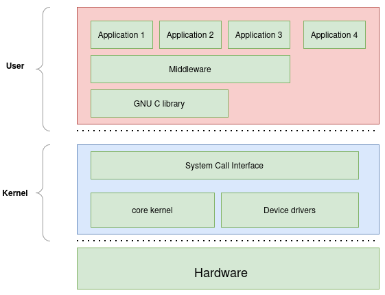
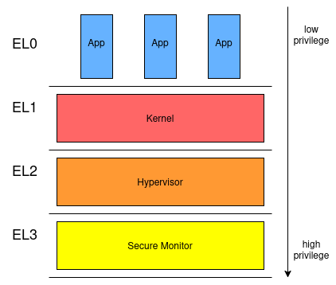
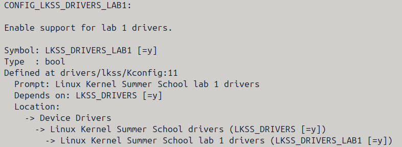

.. _introduction-to-the-linux-kernel:

Introduction to the Linux Kernel
================================

Slides: TODO

Theory
------

What is the Linux Kernel?
~~~~~~~~~~~~~~~~~~~~~~~~~~

The **Linux kernel** is the core of the operating system. It sits between the hardware
and the user-space applications and acts as a resource manager by abstracting the hardware
and providing processes access to priviledged resources.

   Linux kernel architecture overview

The Linux kernel provides the following core services:

- **System calls** – the API that user-space programs use to interact with the kernel
- **Process management** - scheduling, creation, termination of processes
- **Memory management** - virtual memory, page allocation
- **Filesystem support** - VFS layer, ext4, FAT, etc.
- **Networking stack** - protocol stacks (TCP, UDP, IPv4/6), sockets API, etc.

The Linux kernel functionality can be extended through the use of Linux kernel modules
which is kernel code that is dynamically loaded at runtime. The majority of Linux
kernel modules are **device drivers**. A driver is a kernel level code used to allow
applications to communicate with the underlying hardware devices such as sensors,
storage controllers, USB devices, audio devices, etc.

The ARM64 arhitecture isolates software modules through the use of Exception Levels. There are
four exception levels as described in the figure below:

   ARM64 exception levels

The kernel runs in a privileged CPU mode (EL1) while user applications run in
unprivileged mode (EL0). This separation protects the system: a buggy userspace application
cannot crash the kernel, but a buggy **kernel module** can.

The Linux source tree is organized into several top-level directories:

.. list-table::
   :header-rows: 1
   :widths: 20 80

   * - Directory
     - Purpose
   * - ``arch/``
     - Architecture-specific code (``arch/arm64/`` for our board)
   * - ``drivers/``
     - Device drivers (there are tousands of them)
   * - ``fs/``
     - Filesystem implementations
   * - ``include/``
     - Kernel header files
   * - ``mm/``
     - Memory management
   * - ``net/``
     - Networking stack
   * - ``kernel/``
     - Core kernel subsystems (scheduler, timers, IRQs…)
   * - ``Documentation/``
     - In-tree documentation

Root Filesystem and Buildroot
~~~~~~~~~~~~~~~~~~~~~~~~~~~~~~

The Linux kernel it is not useful running standalone, it needs a **root filesystem** (rootfs)
to mount after boot. The rootfs provides:
        
- The init system (``/sbin/init`` or ``busybox init``)
- System libraries (``libc``, ``libm``, ...)
- Userspace tools (``ls``, ``cat``, ``insmod``, ...)
- Device nodes under ``/dev``

For embedded systems, `Buildroot <https://buildroot.org>`_ is a popular tool to generate a
minimal, cross-compiled rootfs together with a toolchain. In this summer school the rootfs
is pre-built for you and is provided as a ``rootfs.ext2``.

The Kernel Image
~~~~~~~~~~~~~~~~

When the kernel source is compiled for an ARM64 target, the build system produces a
file called ``Image`` located at ``arch/arm64/boot/Image``. This is the executable
that the bootloader (U-Boot in our case) loads into RAM and jumps to at boot time.

A few things worth knowing about ``Image``:

- It is **architecture-specific**: the ``Image`` built for ARM64 will not run on x86.
  This is why we need a cross-compiler (``aarch64-linux-gnu-gcc``) on the host.
- It is **self-contained**: the kernel code and built-in drivers (``=y``) are all packed
  into this single file.
- Loadable modules (``.ko`` files) are **not** part of ``Image``; they live on the
  rootfs and are loaded at runtime with ``insmod`` or ``modprobe`` commands.

Kernel Modules
~~~~~~~~~~~~~~

A **kernel module** (``*.ko`` file) is a piece of kernel code that can be loaded and
unloaded at runtime after the kernel has started. This makes development much faster:
you write your driver, compile it as a module, copy it to the rootfs, and load it with
``insmod`` or ``modprobe``.

Every kernel module must define at minimum:

- An **init function** called when the module is loaded (``module_init()``)
- An **exit function** called when the module is unloaded (``module_exit()``)
- License, author, and description metadata (``MODULE_LICENSE``, etc.)

.. code-block:: c

   #include <linux/module.h>
   #include <linux/init.h>

   static int __init hello_init(void)
   {
       printk(KERN_INFO "Hello, kernel!\n");
       return 0;
   }

   static void __exit hello_exit(void)
   {
       pr_info("Goodbye, kernel!\n");
   }

   module_init(hello_init);
   module_exit(hello_exit);

   MODULE_LICENSE("GPL");
   MODULE_AUTHOR("LKSS Student");
   MODULE_DESCRIPTION("Hello World kernel module");

Key points:

- ``__init`` and ``__exit`` are compiler hints that place the functions in special memory
  sections; the kernel frees the ``__init`` section after boot.
- ``pr_info()`` is a shorthand for ``printk(KERN_INFO ...)``. Output goes to the kernel
  log, visible via ``dmesg`` or the serial console.
- A module that returns a non-zero value from its init function fails to load.

Kconfig and Build Options
~~~~~~~~~~~~~~~~~~~~~~~~~

The Linux kernel build system uses **Kconfig** to manage thousands of compile-time
options. For kernel modules, usually *tristate* option is used that can take one of three values:

- ``n`` – excluded from the build entirely
- ``m`` – compiled as a loadable module (``.ko`` file, loaded at runtime with ``insmod``)
- ``y`` – compiled directly into the kernel ``Image`` (built-in, always present at boot)

To keep the Linux kernel Image size small `M` is the recommended selection when building modules.

The ``menuconfig`` tool provides an interactive text menu to browse and change these
options:

.. code-block:: bash

   $ scripts/lkss.py menuconfig

Selections are saved in ``repos/lkss-linux/.config``. Lab drivers live under:

   Linux kernel menuconfig entry

During development always build exercise modules as ``m``. You can then use ``insmod`` or
``modprobe`` to load the module. Switch to ``y`` only when you want the driver to be
present from the very first moment the kernel boots.

Kernel Logging
~~~~~~~~~~~~~~

**printk and pr_* macros**

The kernel's logging function is ``printk()``. Unlike ``printf()``, it prepends a
log level to the message string using a special prefix constant:

.. code-block:: c

   printk(KERN_INFO "Temperature: %d C\n", temp);

``KERN_INFO`` is defined as the string ``"<6>"``, so the full call expands to
``printk("<6>Temperature: %d C\n", temp)``. Because writing ``printk(KERN_*)``
is verbose, the kernel provides shorter ``pr_*`` macros that are equivalent:

.. code-block:: c

   pr_info("Temperature: %d C\n", temp);   /* same as printk(KERN_INFO ...) */
   pr_err("Sensor not found!\n");           /* same as printk(KERN_ERR ...)  */
   pr_warn("Voltage is high: %d mV\n", v); /* same as printk(KERN_WARNING ...)*/

**Log levels**

Every message has a severity level, numbered from 0 (most urgent) to 7 (least urgent):

.. list-table::
   :header-rows: 1
   :widths: 8 20 18 54

   * - Level
     - Constant
     - Macro
     - When to use
   * - 0
     - ``KERN_EMERG``
     - ``pr_emerg()``
     - System is unusable – imminent crash
   * - 1
     - ``KERN_ALERT``
     - ``pr_alert()``
     - Action must be taken immediately
   * - 2
     - ``KERN_CRIT``
     - ``pr_crit()``
     - Critical hardware or software failure
   * - 3
     - ``KERN_ERR``
     - ``pr_err()``
     - Error: something went wrong but the system can continue
   * - 4
     - ``KERN_WARNING``
     - ``pr_warn()``
     - Warning: unexpected but non-fatal condition
   * - 5
     - ``KERN_NOTICE``
     - ``pr_notice()``
     - Normal but significant event
   * - 6
     - ``KERN_INFO``
     - ``pr_info()``
     - Informational messages (the most common level for drivers)
   * - 7
     - ``KERN_DEBUG``
     - ``pr_debug()``
     - Debug messages – silent by default

**dmesg vs the serial console**

All ``printk()`` messages go to the **kernel ring buffer**: a fixed-size circular
buffer in memory. The ``dmesg`` command dumps the entire ring buffer to the standard output.

The **serial console** (the output you see in ``minicom``) behaves differently. It only displays
messages whose log level number is **strictly less than** the **console loglevel**.
This acts as a filter: lower level numbers mean more urgent messages, so only urgent
messages cross the threshold and appear in real time.

.. note::

   A message at level 6 (``KERN_INFO``) reaches the console only when the console
   loglevel is set to 7 or higher.

Read the current loglevel settings from ``/proc/sys/kernel/printk``:

.. code-block:: bash

   cat /proc/sys/kernel/printk

Example output::

   7    4    1    7
   ^    ^    ^    ^
   |    |    |    |-----  default console loglevel at boot
   |    |    |----------  minimum console loglevel (lowest value to which console log level may be set)
   |    |---------------  default message loglevel (used when no level prefix given to printk)
   |--------------------  current console loglevel

With the current console loglevel set to ``7``, messages at levels 0-6 appear on the
serial console in real time. Messages at level 7 (``pr_debug``) are filtered out.

Change the console loglevel at runtime:

.. code-block:: bash

   # Show only KERN_ERR (level 3) and above on the console
   echo 4 > /proc/sys/kernel/printk

   # Show everything, including pr_debug (level 7)
   echo 8 > /proc/sys/kernel/printk

Linux Kernel API
~~~~~~~~~~~~~~~~

**Execution Contexts**

Code that runs inside the Linux kernel can be found in the following two contexts:

- **Process context** – code that runs on behalf of a user-space process (e.g. system call). The
  scheduler can preempt this code and it is allowed to **sleep**.

- **Interrupt context** (also called *atomic context*) – code that runs inside a
  hardware interrupt handler, a timer callback, or while a spinlock is held. The
  scheduler cannot switch tasks here and **no sleeping operations are permitted**.

**Memory Allocation: kmalloc**

``kmalloc()`` is the kernel equivalent of ``malloc()``. It allocates physically
contiguous memory and returns a kernel virtual address, or ``NULL`` on failure.

.. code-block:: c

   #include <linux/slab.h>

   void *ptr = kmalloc(size, flags);
   /* ... use ptr ... */
   kfree(ptr);

The ``flags`` argument controls allocator behaviour when memory is scarce:

.. list-table::
   :header-rows: 1
   :widths: 20 80

   * - Flag
     - When to use
   * - ``GFP_KERNEL``
     - **Process context only.** The allocator may sleep to reclaim memory.
       Use this by default in ``probe()``, ``init()``, and kernel threads.
   * - ``GFP_ATOMIC``
     - **Interrupt / atomic context.** The allocator never sleeps; returns
       ``NULL`` immediately if no memory is available. Use inside IRQ handlers,
       timer callbacks, or when a spinlock is held.

Always check the return value:

.. code-block:: c

   struct my_data *data = kmalloc(sizeof(*data), GFP_KERNEL);
   if (!data)
       return -ENOMEM;

**Kernel Timers**

A kernel timer schedules a callback to run once after a specified delay. The
callback runs in **interrupt context** and must not sleep.

.. code-block:: c

   #include <linux/timer.h>

   struct timer_list my_timer;

   static void my_callback(struct timer_list *t)
   {
       pr_info("Timer fired!\n");
       mod_timer(t, jiffies + HZ);   /* re-arm for another second */
   }

   /* In init/probe */
   timer_setup(&my_timer, my_callback, 0);
   mod_timer(&my_timer, jiffies + HZ);   /* fire after 1 second */

   /* In exit/remove */
   del_timer_sync(&my_timer);   /* waits for any running callback to finish */

``jiffies`` is the kernel tick counter. ``HZ`` is the number of ticks per second
so ``jiffies + HZ`` means "one second from now".

**Spinlocks and Mutexes**

Shared data accessed from more than one context must be protected by a lock.

*Spinlock* – the waiting CPU busy-loops until the lock is free. Safe in both
process and interrupt context. A thread holding a spinlock must not sleep.

.. code-block:: c

   #include <linux/spinlock.h>

   spinlock_t my_lock;
   spin_lock_init(&my_lock);

   /* Process context */
   spin_lock(&my_lock);
   /* ... critical section ... */
   spin_unlock(&my_lock);

   /* When one accessor is an interrupt handler, save/restore IRQ state */
   unsigned long flags;
   spin_lock_irqsave(&my_lock, flags);
   /* ... critical section ... */
   spin_unlock_irqrestore(&my_lock, flags);

*Mutex* – a sleeping lock; the waiting task is put to sleep until the mutex
becomes available. Use mutexes when all accesses happen in process context.

.. code-block:: c

   #include <linux/mutex.h>

   struct mutex my_mutex;
   mutex_init(&my_mutex);

   mutex_lock(&my_mutex);
   /* ... critical section ... */
   mutex_unlock(&my_mutex);

The Device Tree (DTS/DTB)
~~~~~~~~~~~~~~~~~~~~~~~~~

ARM-based SoCs like the i.MX93 do not support hardware auto-discovery. Unlike a PC where
the BIOS can enumerate PCI devices, an embedded SoC has no standard way for software to
scan and find what peripherals are soldered on the board. Instead, the board description
is written by hand in a **Device Tree Source** (``*.dts``) text file, compiled into a
binary **Device Tree Blob** (``*.dtb``), and passed by the bootloader (U-Boot) to the
kernel at boot time. The kernel parses the blob and uses it to know what hardware exists,
where it lives in memory, and which driver should handle it.

**What is a device tree node?**

A device tree is a tree of **nodes**, where each node represents one piece of hardware
(or a logical grouping of hardware). Nodes are enclosed in ``{ }`` and can be nested.
The root of the tree is ``/``:

.. code-block:: dts

   / {
       cpus {
           cpu@0 { /* ... */ };
       };

       memory@80000000 {
           /* ... */
       };

       soc {
           uart1: serial@30880000 {
               /* ... */
           };
       };
   };

A node name has the form ``name@unit-address`` where ``unit-address`` is typically
the base address of the device's registers in hexadecimal. The ``@address`` suffix
is optional for nodes that have no registers (like ``cpus``).

A node can also be given a **label** (``uart1:`` in the example above) so that other
nodes can reference it later using ``&uart1``.

**What is a property?**

Inside a node, **properties** are key-value pairs that describe the device.
They follow the syntax ``property-name = value;``. Values come in several types:

.. code-block:: dts

   node {
       /* String */
       compatible = "vendor,model";

       /* 32-bit integers in angle brackets */
       reg = <0x30880000 0x10000>;   /* one cell = one 32-bit value */

       /* Multiple cells – a list of integers */
       gpios = <&gpio2 4 0>, <&gpio2 14 0>;

       /* Boolean – the property exists or it doesn't */
       big-endian;

       /* Phandle – a reference to another node */
       clocks = <&clk IMX93_CLK_UART1_GATE>;

       status = "okay";
   };

**The most important properties:**

- ``compatible`` – a list of strings (most specific first) that the kernel matches
  against driver tables. For example ``"fsl,imx93-uart", "fsl,imx8ulp-lpuart"`` lets
  the kernel try the i.MX93-specific driver first and fall back to the generic one.
- ``reg`` – the physical address and size of the device's memory-mapped registers.
  Most peripheral nodes have this.
- ``status`` – ``"okay"`` enables the device; ``"disabled"`` (the default for many
  nodes) tells the kernel to skip it. Changing a node from ``disabled`` to ``okay`` in
  the board DTS file is the standard way to activate an optional peripheral.

**Navigating device tree on the board at runtime**

The kernel exposes the parsed device tree under ``/sys/firmware/devicetree/base/``.
You can browse it like a directory:

.. code-block:: bash

   ls /sys/firmware/devicetree/base/
   ls /sys/firmware/devicetree/base/soc@0/
   cat /sys/firmware/devicetree/base/compatible

Each property is a file; each child node is a directory.

**The lkss-bus**

Lab exercises add device nodes under a virtual container node called ``lkss-bus``
with ``compatible = "simple-bus"``. The kernel treats ``simple-bus`` as a transparent
container and probes all its child nodes automatically. It is defined in
``arch/arm64/boot/dts/freescale/imx93-11x11-frdm.dts``:

.. code-block:: dts

   lkss-bus {
       compatible = "simple-bus";

       my-sensor {
           compatible = "lkss,lab1-sensor";
           label = "temperature-sensor";
           sample-rate-hz = <100>;
           max-temp-celsius = <85>;
           status = "okay";
       };
   };

When you add a new child node inside ``lkss-bus`` and rebuild the DTB, the kernel
will try to find a driver whose ``compatible`` string matches your node.

Platform Drivers
~~~~~~~~~~~~~~~~

A **platform driver** is a driver that binds to a device described in the device tree.
The kernel matches the ``compatible`` string of a device tree node against the driver's
``of_device_id`` table and calls the driver's ``probe()`` function when a match is found.
This is how the vast majority of embedded drivers work.

A minimal platform driver looks like this:

.. code-block:: c

   #include <linux/module.h>
   #include <linux/platform_device.h>
   #include <linux/of.h>

   static int my_probe(struct platform_device *pdev)
   {
       dev_info(&pdev->dev, "Device matched and probed!\n");
       return 0;   /* 0 = succes, negative on error */
   }

   static void my_remove(struct platform_device *pdev)
   {
       dev_info(&pdev->dev, "Device removed\n");
   }

   static const struct of_device_id my_dt_ids[] = {
       { .compatible = "lkss,mydevice" },
       { /* sentinel – marks end of table */ },
   };

   static struct platform_driver my_driver = {
       .probe  = my_probe,
       .remove = my_remove,
       .driver = {
           .name           = "my_driver",
           .of_match_table = my_dt_ids,
       },
   };

   module_platform_driver(my_driver);
   MODULE_LICENSE("GPL");

Key points:

- ``probe()`` is called when the kernel finds a device tree node whose ``compatible``
  matches an entry in ``of_device_id``.
- ``remove()`` is called when the module is unloaded.
- ``module_platform_driver()`` is a helper macro that expands to the
  ``module_init`` / ``module_exit`` pair that registers and unregisters the driver.
- ``dev_info()`` / ``dev_err()`` are device-aware variants of ``pr_info()`` /
  ``pr_err()`` that automatically prefix the message with the device name, making
  logs easier to filter. Prefer them over ``pr_*`` whenever a ``struct device *``
  is available:

  .. code-block:: c

     dev_info(&pdev->dev, "probe ok, base_addr=0x%08x\n", addr);
     dev_err(&pdev->dev,  "failed to read register: %d\n", ret);

**Reading device tree properties inside** ``probe()``:

.. code-block:: c

   static int my_probe(struct platform_device *pdev)
   {
       struct device_node *np = pdev->dev.of_node;
       u32 my_value;
       const char *label;
       int ret;

       ret = of_property_read_u32(np, "my-value", &my_value);
       if (ret)
           dev_warn(&pdev->dev, "my-value not found, using default\n");
       else
           dev_info(&pdev->dev, "my-value = %u\n", my_value);

       ret = of_property_read_string(np, "label", &label);
       if (!ret)
           dev_info(&pdev->dev, "label = %s\n", label);

       return 0;
   }

``pdev->dev.of_node`` is a pointer to the device's node in the parsed device tree.
Common helpers for reading properties:

.. list-table::
   :header-rows: 1
   :widths: 50 50

   * - Function
     - Purpose
   * - ``of_property_read_u32(np, "name", &val)``
     - Read a single 32-bit unsigned integer
   * - ``of_property_read_string(np, "name", &str)``
     - Read a string
   * - ``of_property_read_bool(np, "name")``
     - Return ``true`` if the boolean property exists
   * - ``of_property_read_u32_array(np, "name", arr, n)``
     - Read an array of 32-bit integers

----

Lab Exercises
-------------

.. note::

   The lab source code lives in the Linux kernel tree under
   ``repos/lkss-linux/drivers/lkss/lab1/``.

   Before each test cycle the workflow is:

   #. Edit/write your driver in ``repos/lkss-linux/drivers/lkss/lab1/``
   #. Select config option to build your code as a module ``M``

        ``$ ./scripts/lkss.py menuconfig``

   #. Compile the module and copy them to rootfs

      ``$ ./scripts/lkss.py compile --install modules``

   #. In a separate terminal open the serial console

      ``$ minicom -D /dev/ttyACM0``

   #. Boot the board

      ``$ ./scripts/lkss.py boot``

   #. Load the module and observe

      ``$ modprobe your_module.ko``

   #. Unload the module (if requested)

      ``$ rmmod your_module.ko``

1. Anatomy of a Hello World Module
~~~~~~~~~~~~~~~~~~~~~~~~~~~~~~~~~~~~~~~~~~~~~

**1.1 Explore the source**

Open ``repos/lkss-linux/drivers/lkss/lab1/ex1/hello.c`` and read through it carefully.
Make sure you understand the following points before moving on:

- **The init function** is registered with ``module_init()`` and called by the kernel
  when you run ``insmod``. It must return ``0`` on success or a **negative errno** value
  on failure (e.g. ``-ENOMEM``) in which case the module is not loaded.

- **The exit function** is registered with ``module_exit()`` and called when you run
  ``rmmod``. Its job is to undo everything the init function did (e.g free resources).

- ``__init`` and ``__exit`` are compiler hints. The linker places ``__init``
  functions in a special section that the kernel frees from memory after boot, saving
  RAM. ``__exit`` functions are discarded entirely when the driver is compiled as
  built-in (``=y``), because they can never be called.

- ``MODULE_LICENSE("GPL")`` is mandatory. Without it the kernel marks itself as
  *tainted* and GPL marked functions are not available.

**1.2 Enable the module in Kconfig**

Before building, you need to tell the kernel build system to compile the ``lab1`` modules.
Open menuconfig:

.. code-block:: bash

   python3 scripts/lkss.py menuconfig

Navigate to:

.. code-block:: text

   Device Drivers  --->
     Linux Kernel Summer School Drivers  --->
       [M] LKSS Lab 1 drivers

Press ``M`` to select the module (``M`` = build as loadable module). Save and exit.

**1.3 Compile the modules**

.. code-block:: bash

   # Using lkss.py  build kernel + all modules, then install modules into rootfs
   python3 scripts/lkss.py compile -j$(nproc) --install-modules

**1.4 Boot the board and load the module**

.. code-block:: bash

   python3 scripts/lkss.py boot

On the board's serial console:

.. code-block:: bash

   # Load the module
   insmod hello.ko OR modprobe hello.ko
   # why does insmod doesn't work? Find a solution and load the module using both commands above

   # Inspect the kernel log
   dmesg | tail -5

You should see something like:

.. code-block:: text

   [  12.345678] Hello, kernel!

**1.5 Unload the module**

.. code-block:: bash

   rmmod hello
   dmesg | tail -5

Verify the exit message appears.

----

2. Printing from the Kernel
~~~~~~~~~~~~~~~~~~~~~~~~~~~

**2.1 Modify hello.c**

Edit ``repos/lkss-linux/drivers/lkss/lab1/ex1/hello.c``. Add one ``pr_*`` call at each
severity level inside ``hello_init()``. For example:

.. code-block:: c

   pr_emerg("This is EMERG level\n");
   pr_err("This is ERR level\n");
   pr_warn("This is WARNING level\n");
   pr_info("This is INFO level\n");
   pr_debug("This is DEBUG level\n");

Rebuild the module, copy it to the rootfs, boot, and load it:

.. code-block:: bash

   # On host – rebuild and install
   python3 scripts/lkss.py compile -j$(nproc) --install-modules
   python3 scripts/lkss.py boot

   # On board – load and inspect
   modprobe hello.ko

.. code-block:: bash

   # Show all messages with their numeric log level
   dmesg

   # Filter by log level (show only warnings and above)
   dmesg -l warn,err,crit,alert,emerg

**2.2 Dynamic debug**

``pr_debug()`` is silent by default. Enable it for your module at runtime:

.. code-block:: bash

   echo "module hello +p" > /sys/kernel/debug/dynamic_debug/control
   rmmod hello
   insmod hello.ko
   dmesg | tail

----

3. Kernel Log Levels
~~~~~~~~~~~~~~~~~~~~

**3.1 Read the current loglevel settings**

On the board's serial console, run:

.. code-block:: bash

   cat /proc/sys/kernel/printk

Note the four numbers. The first is the **current console loglevel**. With the default
value of ``7``, all messages at levels 0–6 appear on the serial console.

**3.2 Print at every log level**

Make sure the module from Exercise 2 is compiled with one ``pr_*`` call at every level
(see Exercise 2.1). Load it and watch the serial console and ``dmesg`` side by side.

On the board:

.. code-block:: bash

   modprobe hello.ko

Observe that all messages appear in ``dmesg``. Note which ones appear on the serial
console.

**3.3 Lower the console loglevel**

Lower the console loglevel so that only errors and above reach the serial console:

.. code-block:: bash

   echo 4 > /proc/sys/kernel/printk

Now unload and reload the module:

.. code-block:: bash

   rmmod hello
   modprobe hello.ko

Watch the serial console. You should see only ``pr_emerg``, ``pr_alert``,
``pr_crit``, and ``pr_err`` messages (levels 0–3).

Now check ``dmesg``:

.. code-block:: bash

   dmesg | tail -10

All messages are still in the ring buffer and ``dmesg`` is unaffected by the console
loglevel.

**3.4 Raise the console loglevel to show everything**

.. code-block:: bash

   echo 8 > /proc/sys/kernel/printk

Reload the module again and confirm that ``pr_debug()`` output now appears on the
serial console:

.. code-block:: bash

   rmmod hello
   modprobe hello.ko

.. note::

   ``pr_debug()`` is compiled out unless ``CONFIG_DYNAMIC_DEBUG`` is enabled or the
   source file defines ``DEBUG`` before including ``<linux/printk.h>``. If you do not
   see the debug message even at loglevel 8, enable dynamic debug:

   .. code-block:: bash

      echo "module hello +p" > /sys/kernel/debug/dynamic_debug/control

**3.5 Restore the default loglevel**

.. code-block:: bash

   echo 7 > /proc/sys/kernel/printk

----

4. Kernel Oops
~~~~~~~~~~~~~~

**4.1 Explore the source**

Open ``repos/lkss-linux/drivers/lkss/lab1/ex4/oops.c``. The module dereferences a NULL
pointer inside its ``init`` function, which will trigger a kernel oops.

**4.2 Enable and build**

Enable ``CONFIG_LKSS_LAB1_OOPS`` in menuconfig:

.. code-block:: bash

   python3 scripts/lkss.py menuconfig

**4.3 Load the module**

On the board's serial console:

.. code-block:: bash

   modprobe oops.ko

Watch the serial console. You will see output similar to:

.. code-block:: text

   [   15.123456] Unable to handle kernel NULL pointer dereference at virtual address 0000000000000000
   [   15.123456] Mem abort info:
   [   15.123456]   ESR = 0x0000000096000004
   [   15.123456]   EC = 0x25: DABT (current EL), IL = 32 bits
   ...
   [   15.123456] Call trace:
   [   15.123456]  oops_init+0x1c/0x30 [oops]
   [   15.123456]  do_one_initcall+0x54/0x1d0
   ...
   [   15.123456] ---[ end trace ]---

**4.4 Analyze the oops**

Find and understand each part of the oops output:

1. **The faulting address** – the virtual address the kernel tried to access. For a
   NULL dereference it will be ``0x0000000000000000`` (or a small offset from it if
   the code accessed a struct member through a NULL pointer).

2. **The call trace** – the chain of function calls that led to the crash, innermost
   first. You will see ``oops_init`` near the top, followed by the kernel's own
   module-loading machinery (``do_one_initcall``, etc.). This is the primary tool for
   locating the faulty line of code.

- An **oops** is a recoverable fault, the kernel kills the offending process (or in our
  case, aborts the module load) and tries to continue. When the error is unrecoverable
  the oops becomes a ``kernel panic``.

----

5. Linux Kernel API in Practice
~~~~~~~~~~~~~~~~~~~~~~~~~~~~~~~~

**5.1 Explore the skeleton**

Open ``repos/lkss-linux/drivers/lkss/lab1/ex5/api_demo.c``. Locate every ``TODO``
comment – these are the points where you add code.

The file declares:

- ``struct api_demo`` – holds a counter (``u32 count``) and a timer
  (``struct timer_list timer``)
- ``g_demo`` – a global pointer to the dynamically allocated instance
- ``counter_lock`` – a spinlock that protects ``g_demo->count``

**5.2 Allocate the data structure (TODO 5.2)**

In ``api_demo_init()``, allocate ``sizeof(struct api_demo)`` bytes with ``kmalloc()``.
Choose the GFP flag appropriate for a module init function. Return ``-ENOMEM``
if the allocation fails.

Print the allocated size with ``pr_info()`` so you can verify it in ``dmesg``.

**5.3 Set up and arm the timer (TODO 5.3)**

Still in ``api_demo_init()``, call ``timer_setup()`` to bind the timer to the
``tick_callback()`` function already declared in the skeleton. Then call
``mod_timer()`` to schedule the first tick one second from now (``jiffies + HZ``).

**5.4 Implement the timer callback (TODO 5.4)**

Inside ``tick_callback()``:

a. Acquire ``counter_lock`` with the spinlock variant appropriate for interrupt
   context (hint: ``spin_lock_irqsave``).
b. Increment ``g_demo->count``.
c. Release the lock (``spin_unlock_irqrestore``).
d. Print the current counter value with ``pr_info()``.
e. Re-arm the timer for another one-second tick.

**5.5 Clean up on unload (TODO 5.5)**

In ``api_demo_exit()``:

1. Stop the timer with ``del_timer_sync()`` *before* touching the memory the
   callback uses – this guarantees no callback runs after this point.
2. Free ``g_demo`` with ``kfree()``.

**5.6 Build and test**

Enable ``CONFIG_LKSS_LAB1_EX5`` in menuconfig, then build and load:

.. code-block:: bash

   # Host
   python3 scripts/lkss.py compile -j$(nproc) --install-modules
   python3 scripts/lkss.py boot

   # Board
   modprobe api_demo
   dmesg -w

You should see a new message every second::

   [   20.000000] api_demo: allocated 32 bytes
   [   21.000000] api_demo: tick! count = 1
   [   22.000000] api_demo: tick! count = 2
   [   23.000000] api_demo: tick! count = 3

Unload the module and confirm the timer stops::

   rmmod api_demo

----

6. Your First Platform Driver on the lkss-bus
~~~~~~~~~~~~~~~~~~~~~~~~~~~~~~~~~~~~~~~~~~~~~

**6.1 Add a device tree node**

Edit the board device tree: ``repos/lkss-linux/arch/arm64/boot/dts/freescale/imx93-11x11-frdm.dts``

Inside the ``lkss-bus`` node add a new child node:

.. code-block:: dts

   lkss-bus {
       compatible = "simple-bus";

       my-sensor {
           compatible = "lkss,lab1-sensor";
           label = "temperature-sensor";
           sample-rate-hz = <100>;
           max-temp-celsius = <85>;
           status = "okay";
       };
   };

**6.2 Write the platform driver**

Open ``repos/lkss-linux/drivers/lkss/lab1/ex6/platform_sensor.c`` and complete
the TODOs one at a time. After each step rebuild the module, copy it to the
board, and load it to verify the output before moving on.

**6.2a Read the label string** (``TODO 6.2a``)

Inside ``sensor_probe()``, declare a ``const char *label`` variable and call
``of_property_read_string()`` to read the ``"label"`` property from the device
tree node. Print the result with ``dev_info()``:

Expected output after loading the module::

   lkss_sensor my-sensor: sensor probed!
   lkss_sensor my-sensor: label: temperature-sensor

**6.2b Read the sample rate** (Follow ``TODO 6.2b``)

Still inside ``sensor_probe()``, declare a ``u32 rate`` variable and call
``of_property_read_u32()`` to read the ``"sample-rate-hz"`` property. Print it.

Expected additional output::

   lkss_sensor my-sensor: sample rate: 100 Hz

**6.2c Read the maximum temperature** (Follow ``TODO 6.2c``)

Add a ``u32 max_temp`` variable and read the ``"max-temp-celsius"`` property
the same way. Print it.

Expected additional output::

   lkss_sensor my-sensor: max temperature: 85 C

**6.2d. Log sensor removal** (Follow ``TODO 6.2d``)

In ``sensor_remove()``, add a ``dev_info()`` call so that unloading the module
produces a visible message:

.. code-block:: c

   static void sensor_remove(struct platform_device *pdev)
   {
       dev_info(&pdev->dev, "sensor removed\n");
   }

Rebuild, load the module, then unload it with ``rmmod platform_sensor`` and
confirm you see::

   lkss_sensor my-sensor: sensor removed

**6.6. Add a num-channels property**

This step combines a device tree edit with a driver change.

*6.6a. Update the device tree node*

Edit the board device tree: ``repos/lkss-linux/arch/arm64/boot/dts/freescale/imx93-11x11-frdm.dts``

Add ``num-channels = <4>;`` to the ``my-sensor`` node.

*6.6b Read the property in the driver* (Follow  ``TODO 6.6``)

Back in ``sensor_probe()``, add a ``u32 num_channels`` variable and call
``of_property_read_u32()`` to read ``"num-channels"``, then print it:

*6.6c Rebuild and verify*

Rebuild the kernel with the updated DTB and the updated module:

.. code-block:: bash

   python3 scripts/lkss.py compile -j$(nproc) --install-modules
   python3 scripts/lkss.py boot

On the board::

   modprobe platform_sensor
   dmesg | tail -10

You should now see::

   lkss_sensor my-sensor: sensor probed!
   lkss_sensor my-sensor: label: temperature-sensor
   lkss_sensor my-sensor: sample rate: 100 Hz
   lkss_sensor my-sensor: max temperature: 85 C
   lkss_sensor my-sensor: num channels: 4

----

Useful resources
----------------

- `Linux Kernel Labs – Introduction <https://linux-kernel-labs.github.io/refs/heads/master/labs/introduction.html>`_
- `Linux Kernel Labs – Kernel Modules <https://linux-kernel-labs.github.io/refs/heads/master/labs/kernel_modules.html>`_
- `Linux Kernel Labs – Kernel API <https://linux-kernel-labs.github.io/refs/heads/master/labs/kernel_api.html>`_
- `Elixir Cross-referencer (browse Linux source online) <https://elixir.bootlin.com/linux/latest/source>`_
- `Kernel documentation – Writing kernel modules <https://docs.kernel.org/driver-api/>`_
- `Kernel documentation – Device tree usage model <https://docs.kernel.org/devicetree/usage-model.html>`_
- `Kernel documentation – Platform devices and drivers <https://docs.kernel.org/driver-api/platform.html>`_
