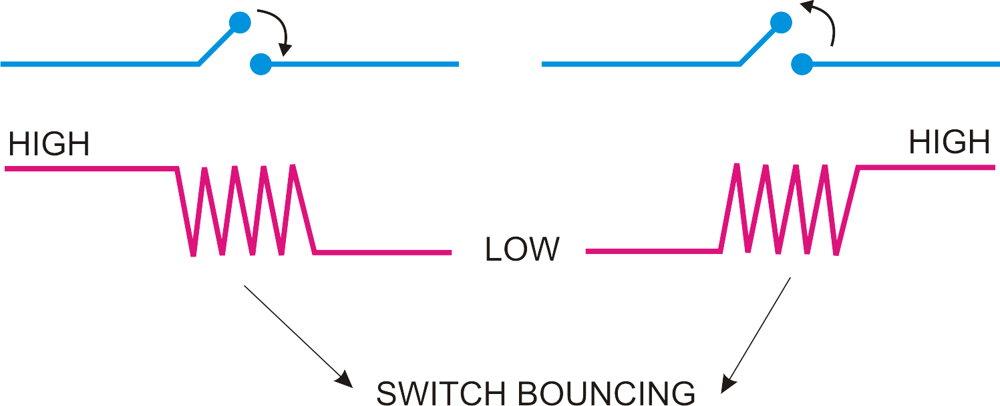

.. _char_devs_gpios_irqs:

Character Devices, GPIOs and IRQs
==================================

Slides: :download:`here <../_static/content/slides/2026/slides_day2.pdf>`

Theory
------

Character Devices
~~~~~~~~~~~~~~~~~

The functionalities we are implementing in the kernel in the form of drivers
can be accessed from userspace through **device files** and their associated
**file operations**: ``open``, ``read``, ``write``, ``ioctl``, ``close``, which
translate to **system calls**. These files can be found in the ``/dev`` directory.

There are two types of device files: **character** and **block**. Character devices
are preferred when data transfer is sequential and small (compared to bulk
transfers). For block devices, the communication via system calls has to go
through the file and block device subsystems.

To check whether a file is a character device file or a block device file, you can use the :manpage:`file(1)` command:

.. code-block:: bash

   $ file -L /dev/tty0
   /dev/tty0: character special (4/0)
   $ file -L /dev/tty1
   /dev/tty1: character special (4/1)
   $ file -L /dev/cdrom
   /dev/cdrom: block special (11/0)

Each device file has a **major** and a **minor** number assigned to it. The major
identifies the device type, while the minor identifies the device number within
that device class. In the commands run above, we can see that /dev/tty0 has major 4
and minor 0, while /dev/tty1 has major 4 and minor 1.

Today we will focus on character devices, as they provide the functionality
we need. So, how do we expose our module's functionality as a character device
in userspace?

First, let's think about the syscalls, or more explicitly, the **file
operations**. We need to implement these first, because they are the
communication channel we have with the userspace. Character devices use
the ``struct file_operations`` structure for this purpose:

.. code-block:: c

   /* snippet taken from include/linux/fs.h */

   struct file_operations {
       struct module *owner;
       loff_t (*llseek) (struct file *, loff_t, int);
       ssize_t (*read) (struct file *, char __user *, size_t, loff_t *);
       ssize_t (*write) (struct file *, const char __user *, size_t, loff_t *);
       [...]
       long (*unlocked_ioctl) (struct file *, unsigned int, unsigned long);
       [...]
       int (*open) (struct inode *, struct file *);
       int (*flush) (struct file *, fl_owner_t id);
       int (*release) (struct inode *, struct file *);
       [...]

One thing to notice is that the signature of the methods does not
match the one they have in userspace. The meaning of ``struct file`` and
``struct inode`` will be explained in the next section, but for now, observe
that only ``open`` and ``release`` take an inode as argument.

After implementing a subset of these file operations, we can register the
character device. During this step, the major and the minor of the device
are generated. The API for registering/unregistering character devices is:

.. code-block:: c

   /* snippet taken from include/linux/fs.h */

   int register_chrdev(unsigned int major, const char *name, const struct file_operations *fops);
   void unregister_chrdev(unsigned int major, const char *name);
   int register_chrdev_region(dev_t first, unsigned int count, char *name);
   void unregister_chrdev_region(dev_t first, unsigned int count);

As you can see, ``register_chrdev`` takes the major, a unique name and the file
operations. If you pass 0 as the major, a valid major is assigned automatically
and returned by the method.

``register_chrdev_region`` can be used to register multiple devices of the same
type. Notice how here there are no file operations passed to the
function. If using this, the character devices need to be initialized using
``cdev_init`` and ``cdev_add``:

.. code-block:: c

   /* snippet taken from include/linux/cdev.h */

   void cdev_init(struct cdev *cdev, struct file_operations *fops);
   int cdev_add(struct cdev *dev, dev_t num, unsigned int count);
   void cdev_del(struct cdev *dev);

``struct cdev`` is the kernel representation of a character device.

After this step, we have a character device but, if you look into ``/dev``,
there is no device file. There are (at least) two ways to create the associated
file:

- using ``mknod`` in userspace (you have to know the major of your device)

.. note::

   See :manpage:`mknod(1)` for usage.

- using ``device_create`` and ``class_create``. ``class_create`` creates a device class in sysfs (``/sys/class``), that will then be passed to ``device_create``. ``device_create`` takes the class, the major and minor of the char device, and the name of the file in ``/dev``.

.. code-block:: c

   /* snippet taken from include/linux/device/class.h */

   struct class *class_create(const char *name);
   void class_destroy(const struct class *cls);

   [...]

   /* snippet taken from include/linux/device.h */

   struct device * device_create(const struct class *cls, struct device *parent, dev_t devt, void *drvdata, const char *fmt, ...);
   void device_destroy(const struct class *cls, dev_t devt);

File representation in the kernel
~~~~~~~~~~~~~~~~~~~~~~~~~~~~~~~~~

Let's get back to ``struct inode`` and ``struct file``. The inclusion rule is
that the ``struct file`` contains a pointer to a ``struct inode``. The **inode**
contains the metadata of the file (think size, permissions, major, minor, etc.).
It can also contain a pointer to the associated character device. In userspace,
you can access this metadata using ``stat``:

.. code-block:: bash

   $ stat /dev/tty0
   File: /dev/tty0
   Size: 0         Blocks: 0          IO Block: 4096   character special file
   Device: 0,6     Inode: 14          Links: 1     Device type: 4,0
   Access: (0620/crw--w----)  Uid: (    0/    root)   Gid: (    5/     tty)
   Access: 2026-06-08 10:12:46.856634157 +0300
   Modify: 2026-06-08 10:13:42.000000000 +0300
   Change: 2026-06-08 10:12:46.856634157 +0300
   Birth: 2026-06-08 10:12:29.140999999 +0300

If you take a look in ``struct inode``, you will see that it contains ``struct
inode_operations *i_ops``. Among them there is ``mknod``, which, as we have seen
in the previous section, can be used to create the file associated with the
char device in userspace.

.. code-block:: bash

   /* snippet taken from include/linux/fs.h */

   struct inode {
          umode_t		i_mode;
          unsigned short	i_opflags;
          unsigned int		i_flags;
   #ifdef CONFIG_FS_POSIX_ACL
          struct posix_acl	*i_acl;
          struct posix_acl	*i_default_acl;
   #endif
          kuid_t		i_uid;
          kgid_t		i_gid;

          const struct inode_operations	*i_op;
          struct super_block	*i_sb;
          struct address_space	*i_mapping;

   #ifdef CONFIG_SECURITY
          void			*i_security;
   #endif
   [...]
   };

The **file** structure is created when the file, that is already on the disk and
has an inode, is opened. The ``struct file`` contains the file path, file opening
flags, the position within the file, the file operations, the inode, etc.

Thus, we can have two ``struct file`` that point to the same ``struct inode``,
meaning we opened that file twice. This is why only ``open`` and ``release``
take a ``struct inode`` as argument, and the rest of the file operations
directly use the ``struct file`` to access what they might need.

.. note::

   Please refer to `include/linux/fs.h <https://elixir.bootlin.com/linux/v7.0.12/source/include/linux/fs.h>`__ for the complete structures.

Misc device
~~~~~~~~~~~

Character devices are complex and, as you have seen, come with a wide variety of
methods that can be used for registering/allocating. Fortunately, if you don't
need the full-fledged functionality of character devices, you can use
miscellaneous devices, which are a subset of that. All miscellaneous devices
have a fixed major (10) and the minor can be assigned dynamically at runtime.

Similar to character devices, you will need to implement the file operations.
Then, you will need to define a misc device as follows:

.. code-block:: c

   static struct miscdevice misc_dev = {
        .minor = MISC_DYNAMIC_MINOR,
        .name  = "misc0",
        .fops  = &fops,
   };

Registering/unregistering is done with the following API:

.. code-block:: c

   /* snippet from include/linux/miscdevice.h */

   int misc_register(struct miscdevice *misc);
   void misc_deregister(struct miscdevice *misc);

``misc_register`` takes care of allocating the device, registering it,
and creating the file node for it in ``/dev``.

Accessing userspace memory
~~~~~~~~~~~~~~~~~~~~~~~~~~

As you know, Linux is split in kernel space and user space. Interaction with the
device node (``/dev/<char_device>``) happens in user space, and the data has to
eventually reach our module in kernel space. Directly dereferencing pointers
from userspace is usually a bad idea, as the memory is mapped differently in
user space vs kernel space. How do we pass data, then?

The answer is that there is an API that manages that data for us:

.. code-block:: c

   /* snippet taken from include/asm/uaccess.h */

   put_user(type val, type *address);
   get_user(type val, type *address);
   unsigned long copy_to_user(void __user *to, const void *from, unsigned long n);
   unsigned long copy_from_user(void *to, const void __user *from, unsigned long n);

As their name suggests, ``copy_to_user`` and ``copy_from_user`` copy data
to/from buffers in user space and kernel space. There are also variants of
these methods that deal with structures directly. ``put_user`` and ``get_user``
do what their name suggests: putting/getting a value to/from an userspace
address.

Lists in the Linux kernel
~~~~~~~~~~~~~~~~~~~~~~~~~

As you already know, data structures can make your life easier if used right.
Lists are a good starting point and a very good foundation for how other data
structures work in the Linux kernel.

Lists in the Linux kernel are circular, doubly-linked lists. One such list is
composed of at least one node, called a head. A list node contains pointers to
the previous and next nodes.

.. code-block:: c

    /* snippet taken from include/linux/types.h */

    struct list_head {
        struct list_head *next, *prev;
    };

To create and populate the initial list head, you can use ``LIST_HEAD(list)``,
where ``list`` will be a ``struct list_head``. This will make the node point to
itself. For dynamically allocating it, use ``INIT_LIST_HEAD``. The list API is
as follows (non-exhaustive):

.. code-block:: c

   /* snippet taken from include/linux/list.h */

   list_add(struct list_head *new, struct list_head *head)
   list_del(struct list_head *entry)
   list_entry(ptr, type, member)
   list_for_each(pos, head)
   list_for_each_safe(pos, n, head)

But where is the data? For now we have only seen the prev and next pointers
in a node. Well, the list API actually only takes ``struct list_head`` as
arguments, but these list nodes are encapsulated in structures, that contain
that data. For example:

.. code-block:: c

   struct my_node {
        u32 data;
        struct list_head list;
   };

This means that it is up to the user to allocate and free this memory.

What are GPIOs? gpiod API
~~~~~~~~~~~~~~~~~~~~~~~~~~

GPIO stands for **General Purpose Input/Output**. In short, these are digital pins
that can have two base states: 0 or 1, and this can be in one of two directions:
input or output. As you might know, there is a transition state between 0->1
called the **rising edge**, and another on 1->0 called a **falling edge**. These are
good to know terms and will be relevant in the next section.

To be able to manipulate its direction and values, you need to get a hold of a
GPIO descriptor (``struct gpio_desc``). This can be done through the ``gpiod_``
API: ``gpiod_get`` and other similar methods. To get/set its value, you can use
``gpiod_get_value`` and ``gpiod_set_value`` which take the previously obtained
descriptor as an argument.

The header file with these methods can be found in `include/linux/gpio/consumer.h <https://elixir.bootlin.com/linux/v7.0.12/source/include/linux/gpio/consumer.h>`__.

What are interrupts and why are they useful?
~~~~~~~~~~~~~~~~~~~~~~~~~~~~~~~~~~~~~~~~~~~~

Let's imagine for a second that we have a single-core CPU, so no way to
parallelize anything. We have to do work and also respond to events with this
limited resource that we have. Events are usually happening pretty rarely with
respect to the CPU frequency. Examples might include keyboard/mouse input. How
do we handle those?

Polling refers to (busy-)waiting for an event to happen and blocking the thread
with this single operation of checking if a flag is true.

.. code-block:: c

   while (button_is_not_pressed) { /* do nothing */ }

While polling has its usecases (which are not the scope of this lab), a
(usually) better way to handle events is by using interrupts. Interrupts
require hardware support to be able to exist, as they are signals triggered in
the hardware and (usually) distributed by an interrupt controller [#]_. They
interrupt the current program context and trigger a switch to what is called an
**interrupt context**, which should handle an event as fast as possible and
return to the normal program flow.

For example, in the context of GPIO, an interrupt can mean a button press turning
an input GPIO from 1 to 0. This change in value (falling edge), triggers an interrupt
and notifies the kernel that this happened so that it can take care of it.

Using the kernel API, the way to handle interrupts coming from GPIOs is to:

- First get the irq number tied to that GPIO: ``gpiod_to_irq``
- Register an irq handler to that irq number and set when you want that to be triggered (IRQF_TRIGGER_RISING, IRQF_TRIGGER_FALLING, etc.): ``request_irq``.

Now, when a button press happens, the program will jump to that handler.

.. note::

   An irq handler is a method within the program. It has to
   try to return as fast as possible, because, while in interrupt
   context, no other interrupts can be handled (all irqs are masked [#]_),
   so you might lose other events happening.

Device managed API
~~~~~~~~~~~~~~~~~~

To avoid memory leaks upon driver detach, you can use the ``devres``, or
device-managed, API. For some of the methods that we have already seen,
there exist ``devm_``-prefixed methods that automatically free the resources
upon driver removal.

Some examples of managed methods that can be used in this lab:

.. code-block:: c

   devm_gpiod_get()
   devm_gpiod_get_index()
   devm_gpiod_get_array()
   devm_request_irq()

.. note::

   To learn more, read the dedicated page `here <https://docs.kernel.org/driver-api/driver-model/devres.html>`__.

Button debouncing
~~~~~~~~~~~~~~~~~

Using buttons usually comes with a phenomenon called signal bouncing. In
our case, since the buttons use pull-up resistors and are registered as pressed
on the falling edge of the signal, things might look like this:

.. _btn_signal_bounce:

   Signal bouncing, active low [#]_

That jitter on the the signal is what produces the rapid succession of interrupts.
To mitigate this, we can do software button debouncing (and yes, debouncing can also
be done in the hardware). This is nothing complicated, the main idea is that we
need to ignore interrupts happening too close to the last one by setting some
kind of timeout, which is usually a few hundred miliseconds. This timeout
depends on the button, so it is best to try multiple values. If you set the
timeout too large, the button responsiveness will drop.

Lab exercises
-------------

.. note::

   Exercises for this lab can be found in ``drivers/lkss/lab2``.

Prerequisites
~~~~~~~~~~~~~

#. Go over the cheatsheet :ref:`here <lkss_cheatsheet>`.

#. Make sure you connect the accessory board as described :ref:`here <lkss-daughter-board-module-connection>`. You can download its schematic from the :ref:`Design files <lkss_daughter_board_design_files>`.

#. Make sure to enable **CONFIG_LKSS_DRIVERS_LAB2** and the related configs in the **menuconfig** before compiling a new exercise.

1. Simple character device (easy)
~~~~~~~~~~~~~~~~~~~~~~~~~~~~~~~~~

**Description**

Implement a simple character device driver that takes input from the user
through its device node ``/dev/simple_char`` and prints it to the kernel log
(see :manpage:`dmesg(1)`). On read, return a custom message ("Hello from char driver!").

**Steps**

- Implement ``my_read`` and ``my_write`` callbacks according to ``TODO 1``, using ``copy_from_user`` and ``copy_to_user`` to get the buffer from/to userspace.

.. note::

   You can also print stuff in the ``my_open`` and ``my_release`` callbacks to observe the flow.

- Implement ``char_init`` and ``char_exit`` callbacks by printing a message using ``printk``. The ``char_init`` message has to include the **major** of the device (You will use it later). In ``char_init``, register the chardev using the implemented file operations.
- Build the module and boot the board

.. hint::

   Use :manpage:`insmod(8)` or :manpage:`modprobe(8)` to load the kernel module

- Now, if you look in ``/dev``, you won't see the character device **yet** because the device node has not been created. To do that, use :manpage:`mknod(1)` and the **major** you printed upon creating the module.

        To create a character device from userspace you can use:

        .. code-block::

                mknod /dev/simple_char c <major> 0 # Here, 'c' stands for character device, and 0 is the minor.

- To test if everything is working correctly, use the :manpage:`cat(1)` and :manpage:`echo(1)` commands as shown **below**. Do you notice how it gets stuck? Think about what ``cat`` and the kernel driver are doing and explain why.

- Try registering your device as a miscellaneous device - follow ``TODO 2``

   .. hint::

      See ``misc_register``, ``misc_unregister``, and ``struct miscdevice``.

**Demo commands**

.. code-block:: bash

   $ echo "Hello!" > /dev/simple_char
   [ 7170.769120] Hello from my_open!
   [ 7170.772318] Recevied message: Hello!
   [ 7170.772318]
   [ 7170.777375] Goodbye from my_release!

   $ cat /dev/simple_char
   [ 7355.971330] Hello from my_open!
   Hello from char driver!
   [ 7356.481053] Goodbye from my_release!

2. Command a timer using a character device (medium)
~~~~~~~~~~~~~~~~~~~~~~~~~~~~~~~~~~~~~~~~~~~~~~~~~~~~~
**Description**

Control a timer by writing expiry times (in seconds) to an associated character device
(``/dev/mytimer``). Use a **list** to store the expiry times if the timer is
still pending. Upon expiry, the timer should continue to run using the next
value.

**Steps**

- The input you give to the character driver is a string, and you need to convert it to an integer. Complete the ``TODO`` in ``string_to_int``.

.. hint::

   Look into `include/linux/kstrtox.h <https://elixir.bootlin.com/linux/v7.0.12/source/include/linux/kstrtox.h>`__.
   There are quite a few methods for converting strings to numbers in the kernel.

- Observe the structures and macros used for the list: ``LIST_HEAD``, ``struct timer_list_entry``, ``list_for_each_prev_safe``, etc. Take a look into ``./include/linux/list.h`` and identify the methods used to insert and delete entries. Then, come back to ``mytimer.c`` and complete the ``TODO`` in ``insert_timeout``, ``get_next_timeout`` and ``destroy_list``.

.. note::

   Think about the order in which you have to add the entries so that the list performs like a queue.

- In ``dev_write``, get the message from the user and parse it. Check if the timer is still pending, and, if so, add the timeout to the list. If it is not pending, start it and save the time you started it. (Will use it later to tell how much time has elapsed).

.. note::

   Observe how we can simply not populate the entry in fops and the kernel will know not to use it.

- Next, implement the timer callback. Print the elapsed time in **seconds**. Then, extract the next entry from the list and start the timer if needed.

.. hint::
   For the elapsed time, use the start time and the jiffies.

- Look in ``mytimer_init`` and ``mytimer_destroy``. Here we initialize/destroy the timer and perform the misc device registration. Similarly to the previous exercise, create the misc device and pass it to ``misc_register``.
- Build the module and boot the board
- Write multiple values to ``/dev/mytimer`` and observe. Keep in mind that these should be in seconds.

**Demo commands**

.. code-block:: bash

   $ echo "6" > /dev/mytimer
   $ echo "5" > /dev/mytimer
   $ echo "4" > /dev/mytimer
   $ echo "3" > /dev/mytimer
   [ 9204.472920] Elapsed time 6s
   [ 9209.592921] Elapsed time 5s
   [ 9213.688920] Elapsed time 4s
   [ 9216.760919] Elapsed time 3s

   $ cat /dev/mytimer
   cat: /dev/mytimer: Invalid argument

3. Command LEDs using GPIOs and character devices (medium)
~~~~~~~~~~~~~~~~~~~~~~~~~~~~~~~~~~~~~~~~~~~~~~~~~~~~~~~~~~

**Description**

Use character devices to switch ON/OFF the 3 leds on the daughter board.
Control them via ``write``/``ioctl``. You can try to also write the userspace program
that uses ``ioctl``.

**Steps**

.. note::

   Notice that this module's structure differs from what we have been doing up until now. Instead of having ``init`` and ``exit`` functions, the module is declared using a **platform driver**. The platform driver contains ``probe`` and ``remove`` methods that have a Device Tree node associated.

- Open ``arch/arm64/boot/dts/freescale/imx93-11x11-frdm.dts`` and search for ``button-led``. Here are declared the GPIOs for the LEDs and buttons needed for this lab. Change the status from ``disabled`` to ``okay`` so that you can use it.

.. note::

   Correlate the numbers of the GPIOs with the schematic.

- Look into ``gpio_led_probe``. There is a third option for registering and creating character devices: Using ``alloc_chrdev_region`` with ``cdev_init`` and ``cdev_add``. This time we allocate 3 (leds) chrdevs and add them one by one. For getting the ``gpio_desc`` associated with each LED, use ``gpiod_get_index``. Lastly, create device using the led_class, as in the previous exercises. Follow the ``TODO`` for more info.
- You will need to get the device minor in the ``read``/``write`` callbacks in order to differentiate between leds. Explore ``struct file`` and ``struct inode`` and find how to get the chrdev associated with the file. Then, use MINOR(cdev->dev) to get the minor. Implement this in ``get_minor``.
- In the file operations callbacks, use ``gpiod_set_value`` and ``gpiod_get_value`` to interract with the previously probed GPIOs.

.. hint::

   Use ``get_minor`` to get the index of the led in the led array.

- Build the module and boot the board.
- After implementing the ``read``/``write`` callbacks, you can implement the ``ioctl`` call as well. Don't forget to enable it in the menuconfig!

.. note::

   To test ``ioctl``, you can write your own userspace app, cross-compile it and copy it to the rootfs using the lkss.py tool. Alternatively, you can download the binary from :download:`here <../_static/content/test_ioctl.zip>`.

**Demo commands**

.. code-block:: bash

   $ echo "1" > /dev/green_led # Turn on green led
   $ echo "1" > /dev/red_led   # Turn on red led
   $ echo "0" > /dev/green_led # Turn off green led
   $ echo "1" > /dev/blue_led  # Turn on blue led

   $ ./test_ioctl 2 0          # Turn off blue led
   $ ./test_ioctl 0 1          # Turn on red led

4. Use buttons to command LEDs (medium++)
~~~~~~~~~~~~~~~~~~~~~~~~~~~~~~~~~~~~~~~~~

**Description**

Use the left/right buttons on the daughter board to move the light from one led to
another, either to the left or to the right. The first and last leds wrap
around, so pushing the left button while the first led in ON means the next led
to be turned ON is the last.

**Steps**

- Look into ``gpio_led_probe``. You can now use ``devm_gpiod_get_array`` to get all led gpios at once.
- Moving on to ``gpio_button_probe``, you will use ``devm_gpiod_get_index`` instead of the array one because we need to associate every button with an irq. To do that, use ``gpiod_to_irq`` to get an interrupt number, then associate an irq handler to the irq number using ``devm_request_irq``.
- In the irq handler implementation, you can use the global int ``current_led_id`` and the already known ``gpiod_set_value``/``gpiod_get_value``. Follow ``TODO 1`` for more info.

.. note::

   Since we are using ``devm_`` (device managed), there is no need to do anything in ``gpios_remove``.

- Build the module and insert it.
- Press the buttons and observe. Do you notice how a button press can sometimes equal multiple interrupts? This is not the desired behaviour, so the next task will fix that by using **debouncing**.
- Follow ``TODO 2`` for this. You will need to set the `debounce_jiffies` variable to `200ms` in jiffies, so that you can use it in the interrupts.
- Next, in each irq, compare the current time (Hint: jiffies) to the last timestamp + the debounce interval. If the interrupt occured before the timeout, return. If you handled the interrupt, save the timestamp (again, by using the jiffies).

.. note::

   Play with the timeout if you feel like the buttons still bounce or if they respond too late to press.

**Demo output**

.. code-block:: bash

   $ dmesg | tail -n 10
   ..
   [  296.893431] Pressed the RIGHT button!
   [  296.897105] green_led turned on!
   [  297.980819] Pressed the RIGHT button!
   [  297.984485] blue_led turned on!
   [  299.673741] Pressed the LEFT button!
   [  299.677319] green_led turned on!
   [  301.019369] Pressed the RIGHT button!
   [  301.023035] blue_led turned on!
   [  305.128024] Pressed the RIGHT button!
   [  305.131694] red_led turned on!

Useful resources
----------------

#. `Kernel List API`_
#. `Linux Kernel Labs - Kernel API`_
#. `Linux Kernel Labs - Device Drivers`_
#. `GPIO Driver API`_
#. `Interrupts in the kernel`_

.. rubric:: Footnotes

.. [#] An interrupt controller is a piece of hardware, an intermediary between
   the CPU(s) and the peripherals, that is responsible with routing and masking
   interrupts. It also prioritizes certain interrupts over others, the ones 'waiting'
   to be processed being in a 'pending' state. An INTC can be configured from SW by writing
   to its registers. For ARM A cores, the interrupt controller is called a GIC
   (General Interrupt Controller), while for M cores there is the NVIC (Nested
   Vectored Interrupt Controller). The GIC is essential for multicore systems.

.. [#] Interrupt masking refers to deciding which interrupts are to be handled and
   which are to be ignored. While in an irq handler, all interrupts are masked.
   Interrupt masking can occur on CPU-level or interrupt-controller-level.

.. [#] https://arduinoplcworld.blogspot.com/2023/06/arduino-button-debounce.html

.. _Kernel List API: https://docs.kernel.org/core-api/list.html

.. _Linux Kernel Labs - Kernel API:  https://linux-kernel-labs.github.io/refs/heads/master/labs/kernel_api.html

.. _Linux Kernel Labs - Device Drivers: https://linux-kernel-labs.github.io/refs/heads/master/labs/device_drivers.html

.. _GPIO Driver API: https://www.kernel.org/doc/html/v4.17/driver-api/gpio/index.html

.. _Interrupts in the kernel: https://www.kernel.org/doc/html/v4.12/core-api/genericirq.html

