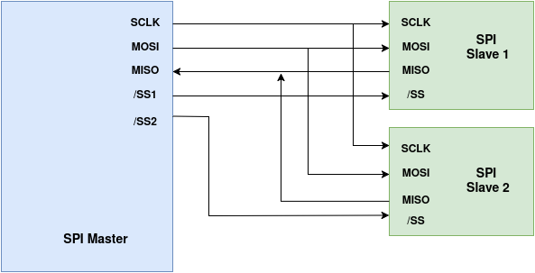
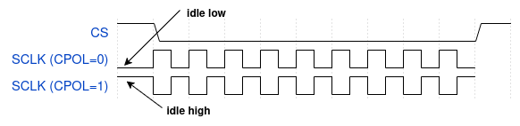
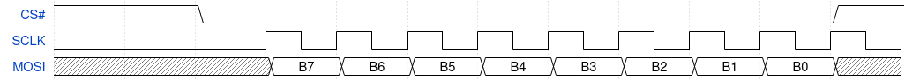
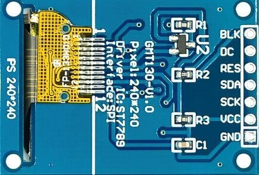
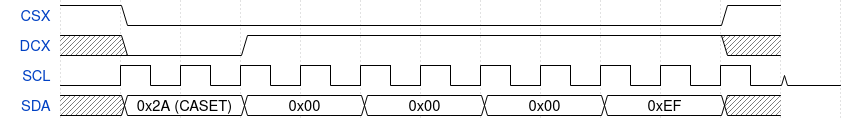
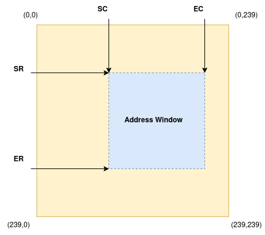
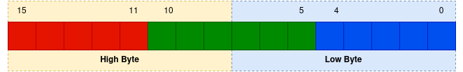

.. _spi-bus-st7789-display:

SPI Bus and the ST7789 Display
==============================

Slides: :download:`here <../_static/content/slides/2026/slides_day3.pdf>`

Theory
------

The Serial Peripheral Interface (SPI)
~~~~~~~~~~~~~~~~~~~~~~~~~~~~~~~~~~~~~

Serial Peripheral Interface (SPI) is a synchronous, full-duplex serial communication bus
that is widely adopted in embedded systems for connecting processors to peripheral devices
including displays, ADCs, DACs, flash memories, sensors and more. SPI is designed for short
distance communication and supports clock frequencies ranging from few MHz for sensors
to 50-100+ MHz for high performance devices such as SPI flash memories.

SPI Signals
^^^^^^^^^^^

On an SPI bus, one device acts as the **master** initiating all the communication by generating
the clock signal and selecting the target device. The remaining devices act as **slaves** and
respond only when selected.

A typical master is a microcontroller, microprocessor or a System-on-Chip (SoC)
while common slave devices include sensors, analog-to-digital converters (ADCs),
digital-to-analog converters (DACs), displays and flash memories.

A standard SPI bus uses **four signals**:

+----------------+----------------------+---------------------------------------------------------------+
| Signal         | Direction            | Description                                                   |
+================+======================+===============================================================+
| **SCLK**       | Master -> Slave      | Serial clock generated by the master                          |
+----------------+----------------------+---------------------------------------------------------------+
| **MOSI**       | Master -> Slave      | Master Out Slave In. Data sent from the master to the slave   |
+----------------+----------------------+---------------------------------------------------------------+
| **MISO**       | Slave  -> Master     | Master In Slave Out. Data sent from the slave to the master   |
+----------------+----------------------+---------------------------------------------------------------+
| **CS/SS**      | Master -> Slave      | Chip Select (active low)                                      |
+----------------+----------------------+---------------------------------------------------------------+

.. note::

   Modern documentation increasingly uses the terms **controller** and
   **peripheral** (or **host** and **device**) instead of **master** and
   **slave**. However, the traditional terminology and signal names
   (MOSI, MISO, SS) are still widely encountered in datasheets and
   technical literature.

Multiple devices may share SCLK, MOSI, and MISO, each with its own CS# line:

   Typical SPI signals: Master and two slave devices

The Serial Clock (SCLK)
^^^^^^^^^^^^^^^^^^^^^^^

The **Serial Clock (SCLK)** signal is generated by the master device.
As a result, slave devices do not need their own clock source and they will
use the clock generated by the master device.

SPI doesn't have a standardized clock rate but typically operates in the **MHz range**.
The purpose of the clock is to indicate to the receiver when data should be sampled.  Each
clock cycle corresponds to one bit of data being transferred.

Depending on the SPI configuration:

- The clock can remain **idle low** or **idle high**.
- Data can be sampled on either the **rising edge** or the **falling edge**
  of the clock signal.

Clock Polarity
^^^^^^^^^^^^^^

Clock polarity (CPOL) defines the **idle state** of the SCLK line, that is
the level when the clock is idle (when the bus is not transferring data).

- **CPOL=0**, SCLK idles **LOW**. The first clock transition after CS
  asserts is therefore a *rising* edge.
- **CPOL=1**, SCKL idles **HIGH**. The first clock transition after CS
  asserts is therefore a *falling* edge.

   SPI Clock Polarity (CPOL)

Clock Phase
^^^^^^^^^^^

Clock Phase (CPHA) determines which edge of the clock signal is used to read
(sample) or write (shift) the data.

- **CPHA=0**, data is sampled on the **leading** (first) edge of each
  clock pulse and shifted out on the trailing edge.
- **CPHA=1**, data is shifted out on the leading edge and sampled on
  the **trailing** (second) edge.

CPOL and CPHA combine into four modes:

+------+------+--------+-----------------------------------------------------------+
| CPOL | CPHA | Mode   | Behaviour                                                 |
+======+======+========+===========================================================+
| 0    | 0    | Mode 0 | SCKL idles **low**, shifted on falling edge, sampled on   |
|      |      |        | **rising** edge. Default in Linux                         |
+------+------+--------+-----------------------------------------------------------+
| 0    | 1    | Mode 1 | SCKL idles **low**, shifted on rising edge, sampled on    |
|      |      |        | **falling** edge.                                         |
+------+------+--------+-----------------------------------------------------------+
| 1    | 0    | Mode 2 | SCKL idles **high**, shifted on falling edge, sampled on  |
|      |      |        | **falling** edge.                                         |
+------+------+--------+-----------------------------------------------------------+
| 1    | 1    | Mode 3 | SCKL idles **high**, shifted on rising edge, sampled on   |
|      |      |        | **rising** edge.                                          |
+------+------+--------+-----------------------------------------------------------+

SPI Transaction
^^^^^^^^^^^^^^^^

A typical SPI one byte transmission starts with master asserting **CS# low** to select
the slave device. Once CS# is asserted, the master starts generating **SCLK** clock signal.
Data is driven by the master on the **MOSI** line, transmitted **MSB** first: bit 7
(most significant) is placed on the MOSI line first and bit 0 (least significant) is placed last.
Once all the 8 bits have been clocked out, the master stops the clock and drives the CS# high
signalling the end of transmission.

   SPI single byte transmission (Mode 0, MSB first)

Overview
^^^^^^^^

The **ST7789VW** (Sitronix) is a single-chip TFT-LCD controller with on-chip frame memory.
Key characteristics, see `datahseet <https://www.waveshare.com/w/upload/a/ad/ST7789VW.pdf>`_:

- Maximum resolution: **240 (H) × 320 (V)** RGB pixels
- On-chip frame buffer: 240 × 320 × 18 bits
- Pixel formats: 12 bpp (RGB444), **16 bpp (RGB565)**, 18 bpp (RGB666)
- 4-wire SPI interface (SCL, SDA, CS, DCX) — **no MISO needed for display use**
- Operating supply: 3.3 V
- The 240×240 module physically crops the 240×320 controller to 240 rows

ST7789 Interface Pins (SPI 4-Line Mode)
^^^^^^^^^^^^^^^^^^^^^^^^^^^^^^^^^^^^^^^^

   ST7789V TFT display, 240 x 240

+-----------------+-----------+--------------------------------------------------------------+
| Pin Name        | Direction | Description                                                  |
+=================+===========+==============================================================+
| **GND**         | Power     | Ground reference.                                            |
+-----------------+-----------+--------------------------------------------------------------+
| **VCC**         | Power     | Connect to 3.3 V only.                                       |
+-----------------+-----------+--------------------------------------------------------------+
| **SCL** (SCK)   | Input     | Serial clock. Maximum write frequency **62.5 MHz**           |
+-----------------+-----------+--------------------------------------------------------------+
| **SDA** (MOSI)  | Input     | Serial data in. Clocked on rising edge of SCL (SPI Mode 0).  |
+-----------------+-----------+--------------------------------------------------------------+
| **RES**         | Input     | Hardware reset, **active-low**.                              |
+-----------------+-----------+--------------------------------------------------------------+
| **DC**          | Input     | Data / Command select. **LOW** = command **HIGH** = data     |
+-----------------+-----------+--------------------------------------------------------------+
| **BLK**         | Input     | Backlight enable. Connect to 3.3 V for always-on backlight.  |
+-----------------+-----------+--------------------------------------------------------------+
| **CS**          | Input     | Chip select, **active-low**.                                 |
|                 |           | Tied to GND on the module (always selected).                 |
+-----------------+-----------+--------------------------------------------------------------+

4-Line SPI Protocol: Command vs. Data
^^^^^^^^^^^^^^^^^^^^^^^^^^^^^^^^^^^^^^^

The defining feature of the 4-line SPI protocol is the **DCX signal**, which
tells the controller whether each incoming byte is a command opcode or a
data parameter / pixel byte:

   DCX set LOW for commmand, HIGH for parameters/data

The diagram above shows a complete CASET (Column Address Set) transaction
on the SPI bus. CASET is command ``0x2A`` and must be sent before every
``RAMWR`` pixel write to define the horizontal drawing window.

The transaction consists of five bytes sent in a single CS assertion:

- **CSX** is pulled low for the entire transaction and released only
  after the last parameter byte.

- **DCX** is held low during the first byte only, telling the ST7789V
  that ``0x2A`` is a **command**. It then goes high and stays high for
  the four parameter bytes that follow.

- **SDA** carries the five bytes in sequence, MSB first:

  +----------+-------+---------------------------+
  | Byte     | Value | Meaning                   |
  +==========+=======+===========================+
  | Command  | 0x2A  | CASET, column address set |
  +----------+-------+---------------------------+
  | SC high  | 0x00  | Start column high byte    |
  +----------+-------+---------------------------+
  | SC low   | 0x00  | Start column low byte     |
  +----------+-------+---------------------------+
  | EC high  | 0x00  | End column high byte      |
  +----------+-------+---------------------------+
  | EC low   | 0xEF  | End column low byte (239) |
  +----------+-------+---------------------------+

After this transaction the ST7789V drawing window spans all 240 columns
from the left edge (column 0) to the right edge (column 239). A
subsequent ``RASET`` (``0x2B``) sets the row range and ``RAMWR``
(``0x2C``) begins the pixel data stream into the defined window.

ST7789 GRAM and Address Window
^^^^^^^^^^^^^^^^^^^^^^^^^^^^^^^^

The ST7789V has internal **Display Data RAM (GRAM)** organised as a
240x240 grid of pixels (240 rows by 240 columns).

Before writing any pixel data the ST7789V must know exactly which region
of GRAM to fill. This is done by sending three commands in sequence:

**CASET** (0x2A) defines the horizontal boundaries of the write window
by specifying a pair of column addresses: **SC** (Start Column) sets the
left edge and **EC** (End Column) sets the right edge. Any column address
outside the (SC, EC) pair is not written.

**RASET** (0x2B) defines the vertical boundaries by specifying a pair of
row addresses: **SR** (Start Row) sets the top edge and **ER** (End Row)
sets the bottom edge. Any row address outside the (SR, ER) pair is not
written.

Together (SC, EC) and (SR, ER) define a rectangular write window inside
GRAM. Once both commands have been sent, **RAMWR** (0x2C) opens the
pixel data stream. The controller writes incoming pixels into the window
starting at (SC, SR), the top-left corner and auto-increments the
write pointer left to right across each row, then moves to the next row
down, until the bottom-right corner (EC, ER) is reached.

   ST7789V - 240 x 240 GRAM address window

ST7789 Initialization Sequence
^^^^^^^^^^^^^^^^^^^^^^^^^^^^^^^^

After hardware reset the controller is in sleep mode. The essential bring-up sequence is:

.. code-block:: c

    st7789_hw_reset(priv);
    st7789_init_display(priv)

Where we need to reset the chip by drive RESX LOW > 15 ms, then HIGH; wait > 120 ms.

.. code-block:: c

   static void st7789_hw_reset(struct st7789_priv *priv)
   {
       gpiod_set_value(priv->reset, 1);   /* assert RESX LOW (active-low) */
       msleep(20);                         /* hold > 15 ms */
       gpiod_set_value(priv->reset, 0);   /* deassert RESX HIGH */
       msleep(150);                        /* wait> 120 ms before cmds */
   }

And them perform minimal initializaton sequence as below:

.. code-block:: c

   static int st7789_init_display(struct st7789_priv *priv)
   {

     st7789_write_cmd(priv, ST7789_SLPOUT);    /* exit sleep; wait 500ms */
     msleep(500);
     st7789_write_cmd(priv, ST7789_COLMOD);    /* pixel format           */
     st7789_write_data_byte(priv, 0x55);       /* 0x55 = RGB565          */
     st7789_write_cmd(priv, ST7789_MADCTL);    /* memory access control  */
     st7789_write_data_byte(priv, 0x00);       /* normal orientation     */
     st7789_write_cmd(priv, ST7789_INVON);     /* inversion on           */
     st7789_write_cmd(priv, ST7789_NORON);     /* normal display mode    */
     st7789_write_cmd(priv, ST7789_DISPON);    /* display on; wait 100ms */
     msleep(100);
     return 0;
   }

Essential ST7789 Commands
^^^^^^^^^^^^^^^^^^^^^^^^^^

+----------------+--------+--------+-------------------------------------------------------+
| Mnemonic       | Opcode | Params | Description                                           |
+================+========+========+=======================================================+
| **SWRESET**    | 0x01   | 0      | Software reset. Wait > 150 ms after issuing.          |
+----------------+--------+--------+-------------------------------------------------------+
| **SLPOUT**     | 0x11   | 0      | Exit sleep mode. Wait > 500 ms after issuing.         |
+----------------+--------+--------+-------------------------------------------------------+
| **INVOFF**     | 0x20   | 0      | Display inversion off.                                |
+----------------+--------+--------+-------------------------------------------------------+
| **INVON**      | 0x21   | 0      | Display inversion on (required on most ST7789         |
|                |        |        | modules).                                             |
+----------------+--------+--------+-------------------------------------------------------+
| **DISPOFF**    | 0x28   | 0      | Display off. Output blanked, GRAM retained.           |
+----------------+--------+--------+-------------------------------------------------------+
| **DISPON**     | 0x29   | 0      | Display on. Wait > 100 ms after issuing.              |
+----------------+--------+--------+-------------------------------------------------------+
| **CASET**      | 0x2A   | 4      | Column address set: SC_H, SC_L, EC_H, EC_L            |
|                |        |        | (big-endian pairs defining the column window).        |
+----------------+--------+--------+-------------------------------------------------------+
| **RASET**      | 0x2B   | 4      | Row address set: SR_H, SR_L, ER_H, ER_L               |
|                |        |        | (big-endian pairs defining the row window).           |
+----------------+--------+--------+-------------------------------------------------------+
| **RAMWR**      | 0x2C   | N      | Memory write. All subsequent bytes are pixel data     |
|                |        |        | filling the window defined by CASET and RASET.        |
+----------------+--------+--------+-------------------------------------------------------+
| **MADCTL**     | 0x36   | 1      | Memory access control: rotation, mirror, RGB/BGR      |
|                |        |        | order. Controls physical (0,0) origin.                |
+----------------+--------+--------+-------------------------------------------------------+
| **COLMOD**     | 0x3A   | 1      | Pixel format. 0x55 = RGB565 (16 bpp),                 |
|                |        |        | 0x66 = RGB666 (18 bpp).                               |
+----------------+--------+--------+-------------------------------------------------------+
| **PORCTRL**    | 0xB2   | 5      | Porch control (front/back porch timing).              |
+----------------+--------+--------+-------------------------------------------------------+
| **GCTRL**      | 0xB7   | 1      | Gate control (VGH/VGL switching speed).               |
+----------------+--------+--------+-------------------------------------------------------+
| **VCOMS**      | 0xBB   | 1      | VCOM voltage setting.                                 |
+----------------+--------+--------+-------------------------------------------------------+
| **PWCTRL1**    | 0xD0   | 2      | Power control 1 (AVDD, AVCL, VDS).                    |
+----------------+--------+--------+-------------------------------------------------------+
| **PVGAMCTRL**  | 0xE0   | 14     | Positive voltage gamma control curve.                 |
+----------------+--------+--------+-------------------------------------------------------+
| **NVGAMCTRL**  | 0xE1   | 14     | Negative voltage gamma control curve.                 |
+----------------+--------+--------+-------------------------------------------------------+

Complete initialization function:

.. code-block:: c

	static int st7789_init_display(struct st7789_priv *priv)
	{
		static const u8 porctrl[]   = { 0x05, 0x05, 0x00, 0x33, 0x33 };
		static const u8 vdvvrhen[]  = { 0x01, 0xFF };
		static const u8 pwctrl1[]   = { 0xA4, 0xA1 };
		static const u8 pvgamctrl[] = { 0xD0, 0x05, 0x0A, 0x09, 0x08, 0x05, 0x2E,
						0x44, 0x45, 0x0F, 0x17, 0x16, 0x2B, 0x33 };
		static const u8 nvgamctrl[] = { 0xD0, 0x05, 0x0A, 0x09, 0x08, 0x05, 0x2E,
						0x43, 0x45, 0x0F, 0x16, 0x16, 0x2B, 0x33 };
		int ret;

		ret = st7789_write_cmd(priv, ST7789_SLPOUT);
		if (ret) return ret;
		msleep(600);

		ret = st7789_write_cmd(priv, ST7789_COLMOD);
		if (ret) return ret;
		ret = st7789_write_data_byte(priv, ST7789_COLMOD_RGB565);
		if (ret) return ret;

		ret = st7789_write_cmd(priv, ST7789_PORCTRL);
		if (ret) return ret;
		ret = st7789_write_data(priv, porctrl, sizeof(porctrl));
		if (ret) return ret;

		ret = st7789_write_cmd(priv, ST7789_GCTRL);
		if (ret) return ret;
		ret = st7789_write_data_byte(priv, 0x75);
		if (ret) return ret;

		ret = st7789_write_cmd(priv, ST7789_VDVVRHEN);
		if (ret) return ret;
		ret = st7789_write_data(priv, vdvvrhen, sizeof(vdvvrhen));
		if (ret) return ret;

		ret = st7789_write_cmd(priv, ST7789_VRHS);
		if (ret) return ret;
		ret = st7789_write_data_byte(priv, 0x13);
		if (ret) return ret;

		ret = st7789_write_cmd(priv, ST7789_VDVS);
		if (ret) return ret;
		ret = st7789_write_data_byte(priv, 0x20);
		if (ret) return ret;

		ret = st7789_write_cmd(priv, ST7789_VCOMS);
		if (ret) return ret;
		ret = st7789_write_data_byte(priv, 0x22);
		if (ret) return ret;

		ret = st7789_write_cmd(priv, ST7789_VCMOFSET);
		if (ret) return ret;
		ret = st7789_write_data_byte(priv, 0x20);
		if (ret) return ret;

		ret = st7789_write_cmd(priv, ST7789_PWCTRL1);
		if (ret) return ret;
		ret = st7789_write_data(priv, pwctrl1, sizeof(pwctrl1));
		if (ret) return ret;

		ret = st7789_write_cmd(priv, ST7789_DISPON);
		if (ret) return ret;
		msleep(150);

		ret = st7789_write_cmd(priv, ST7789_INVON);
		if (ret) return ret;

		ret = st7789_write_cmd(priv, ST7789_MADCTL);
		if (ret) return ret;
		ret = st7789_write_data_byte(priv, ST7789_MADCTL_NORMAL);
		if (ret) return ret;

		ret = st7789_write_cmd(priv, ST7789_PVGAMCTRL);
		if (ret) return ret;
		ret = st7789_write_data(priv, pvgamctrl, sizeof(pvgamctrl));
		if (ret) return ret;

		ret = st7789_write_cmd(priv, ST7789_NVGAMCTRL);
		if (ret) return ret;
		ret = st7789_write_data(priv, nvgamctrl, sizeof(nvgamctrl));
		if (ret) return ret;

		return 0;
	}

.. _st7789-part4:

RGB565 Pixel Format
~~~~~~~~~~~~~~~~~~~

RGB565 Bit Layout
^^^^^^^^^^^^^^^^^^

RGB565 encodes one pixel into **16 bits** spread across two bytes. The
**high byte** (sent first over SPI) carries the 5 red bits in its upper
half and the top 3 bits of green in its lower half. The **low byte**
(sent second) carries the remaining 3 bits of green followed by the 5
blue bits. Green gets 6 bits instead of 5 because the human eye is most
sensitive to green and the extra bit doubles its resolution. The full
16-bit value is assembled as ``pixel = (R << 11) | (G << 5) | B``,
giving 32 levels of red, 64 levels of green, and 32 levels of blue —
65,536 colours in total.

   RGB565 format - encodes (R, G, B) values into 2 bytes

Common color constants:

+----------+-------------+-----------------------------------+
| Color    | RGB565 value| Components (R, G, B)              |
+==========+=============+===================================+
| Red      | ``0xF800``  | R=31 (max), G=0,       B=0        |
+----------+-------------+-----------------------------------+
| Green    | ``0x07E0``  | R=0,        G=63 (max), B=0       |
+----------+-------------+-----------------------------------+
| Blue     | ``0x001F``  | R=0,        G=0,       B=31 (max) |
+----------+-------------+-----------------------------------+
| White    | ``0xFFFF``  | R=31 (max), G=63 (max), B=31 (max)|
+----------+-------------+-----------------------------------+
| Black    | ``0x0000``  | R=0,        G=0,        B=0       |
+----------+-------------+-----------------------------------+
| Yellow   | ``0xFFE0``  | R=31 (max), G=63 (max), B=0       |
+----------+-------------+-----------------------------------+
| Cyan     | ``0x07FF``  | R=0,        G=63 (max), B=31(max) |
+----------+-------------+-----------------------------------+
| Magenta  | ``0xF81F``  | R=31 (max), G=0,     B=31(max)    |
+----------+-------------+-----------------------------------+

.. _st7789-part5:

ST7789 Driver Functions Reference
~~~~~~~~~~~~~~~~~~~~~~~~~~~~~~~~~

This section provides complete, copy-pasteable implementations of every function
students must implement.  Use these as a reference, read and understand each
function before implementing it yourself in the skeleton.

.. _st7789-part5-1:

Low-level SPI Primitives
^^^^^^^^^^^^^^^^^^^^^^^^^^^^^^

The two fundamental building blocks are ``st7789_write_cmd()`` and
``st7789_write_data()``.  Every higher-level function calls one or both of these.

The **DCX (D/C) GPIO** determines whether the byte being clocked is a command
opcode or a data byte.

.. code-block:: text

   Writing command 0x2C (RAMWR):
     Step 1: gpiod_set_value(dc, 0)  -> DCX = LOW  = command
     Step 2: spi_write(spi, &0x2C, 1)

   Writing 2 data bytes {0xF8, 0x00} (one red pixel):
     Step 1: gpiod_set_value(dc, 1)     -> DCX = HIGH = data
     Step 2: spi_write(spi, buf, 2)

.. code-block:: c

   /* Set DCX LOW then clock the command opcode. */
   static int st7789_write_cmd(struct st7789_priv *priv, u8 cmd)
   {
       gpiod_set_value(priv->dc, 0);
       return spi_write(priv->spi, &cmd, 1);
   }

   /* Set DCX HIGH then clock len data bytes. */
   static int st7789_write_data(struct st7789_priv *priv,
                                const u8 *buf, size_t len)
   {
       gpiod_set_value(priv->dc, 1);
       return spi_write(priv->spi, buf, len);
   }

   /* Convenience wrapper: send a single data byte. */
   static inline int st7789_write_data_byte(struct st7789_priv *priv, u8 byte)
   {
       return st7789_write_data(priv, &byte, 1);
   }

.. _st7789-part5-2:

Hardware Reset
^^^^^^^^^^^^^^

The reset line is declared ``GPIO_ACTIVE_LOW`` in the device tree and obtained
with ``GPIOD_OUT_HIGH`` (i.e., deasserted on boot).  To assert reset we write
logical 1 (the gpiod layer inverts to physical LOW):

.. code-block:: c

   static void st7789_hw_reset(struct st7789_priv *priv)
   {
       gpiod_set_value(priv->reset, 1);   /* assert RESX LOW (active-low) */
       msleep(20);                         /* hold > 15 ms                */
       gpiod_set_value(priv->reset, 0);   /* deassert RESX HIGH           */
       msleep(150);                        /* wait > 120 ms before cmds   */
   }

.. _st7789-part5-3:

Address Window: st7789_set_addr_win
^^^^^^^^^^^^^^^^^^^^^^^^^^^^^^^^^^^

The address window defines the rectangular region of GRAM that subsequent RAMWR
pixel data will fill.  CASET sets the column (X) range; RASET sets the row (Y)
range.  Each takes **four bytes encoding two big-endian 16-bit values**:

.. code-block:: text

   CASET parameter encoding for x0=0, x1=239:

   Byte 0: x0 >> 8  = 0x00    ->start column (big-endian)
   Byte 1: x0 & 0xFF= 0x00
   Byte 2: x1 >> 8  = 0x00    -> end column (big-endian)
   Byte 3: x1 & 0xFF= 0xEF       (239 = 0x00EF)

   RASET parameter encoding for y0=10, y1=49 (a 40-row band):

   Byte 0: 0x00   -> start row = 10 = 0x000A
   Byte 1: 0x0A
   Byte 2: 0x00   -> end row   = 49 = 0x0031
   Byte 3: 0x31

   After CASET + RASET, send RAMWR to open the pixel data stream.
   Pixel data then fills the window left-to-right, top-to-bottom.

.. code-block:: c

   static int st7789_set_addr_win(struct st7789_priv *priv,
                                  u16 x0, u16 y0, u16 x1, u16 y1)
   {
       u8 col[4] = { x0 >> 8, x0 & 0xff, x1 >> 8, x1 & 0xff };
       u8 row[4] = { y0 >> 8, y0 & 0xff, y1 >> 8, y1 & 0xff };
       int ret;

       ret = st7789_write_cmd(priv, ST7789_CASET);
       if (ret) return ret;
       ret = st7789_write_data(priv, col, 4);
       if (ret) return ret;

       ret = st7789_write_cmd(priv, ST7789_RASET);
       if (ret) return ret;
       ret = st7789_write_data(priv, row, 4);
       if (ret) return ret;

       return st7789_write_cmd(priv, ST7789_RAMWR);
   }

.. _st7789-part5-4:

Full-screen Fill: st7789_fill
^^^^^^^^^^^^^^^^^^^^^^^^^^^^^

``st7789_fill()`` paints the entire panel with a single color.  The naive approach
of calling ``st7789_draw_pixel()`` 240 x 240 = 57600 times would issue **172,800 SPI
transactions** (3 per pixel: CASET + RASET + RAMWR).  Instead, we:

1. Set one full-panel address window (3 SPI transactions total).
2. Allocate one scanline buffer (``width * 2`` bytes) and fill it with the repeated color.
3. Send that buffer once per row (240 SPI transactions of 480 bytes each).

.. code-block:: c

   static int st7789_fill(struct st7789_priv *priv, u16 color)
   {
       u8 color_hi = color >> 8;
       u8 color_lo = color & 0xff;
       u8 *line;
       int ret = 0, x, y;

       ret = st7789_set_addr_win(priv, 0, 0, priv->width - 1, priv->height - 1);
       if (ret) return ret;

       line = kmalloc(priv->width * 2, GFP_KERNEL);
       if (!line) return -ENOMEM;

       /* Build one scanline of the repeated color in big-endian */
       for (x = 0; x < priv->width; x++) {
           line[x * 2]     = color_hi;
           line[x * 2 + 1] = color_lo;
       }

       /* Send the scanline once per row */
       for (y = 0; y < priv->height; y++) {
           ret = st7789_write_data(priv, line, priv->width * 2);
           if (ret) break;
       }

       kfree(line);
       return ret;
   }

.. _st7789-part5-5:

Single Pixel: st7789_draw_pixel
^^^^^^^^^^^^^^^^^^^^^^^^^^^^^^^

A pixel is a **1×1 address window**.  Set CASET(x,x) RASET(y,y) then send the
two-byte RGB565 value.  Note: the ST7789 expects big-endian — high byte first.

.. code-block:: text

   For pixel color 0x07FF (cyan):
     Byte sent 1st: 0x07   (bits 15:8 of 0x07FF)
     Byte sent 2nd: 0xFF   (bits  7:0 of 0x07FF)

.. code-block:: c

   static int st7789_draw_pixel(struct st7789_priv *priv,
                                u16 x, u16 y, u16 color)
   {
       u8 pixel[2] = { color >> 8, color & 0xff };
       int ret;

       if (x >= priv->width || y >= priv->height) return 0;

       ret = st7789_set_addr_win(priv, x, y, x, y);
       if (ret) return ret;
       return st7789_write_data(priv, pixel, 2);
   }

.. _st7789-part5-6:

Filled Rectangle: st7789_fill_rect
^^^^^^^^^^^^^^^^^^^^^^^^^^^^^^^^^^

``st7789_fill_rect()`` is a generalisation of ``st7789_fill()``: the address window
is an arbitrary sub-rectangle instead of the full screen.  Coordinate clamping
ensures callers do not need to range-check their arguments:

.. code-block:: c

   static int st7789_fill_rect(struct st7789_priv *priv,
                               u16 x, u16 y, u16 w, u16 h, u16 color)
   {
       u8 color_hi = color >> 8;
       u8 color_lo = color & 0xff;
       u8 *line;
       int ret = 0;
       u16 i, row;

       /* Clamp to panel boundaries */
       if (x >= priv->width || y >= priv->height) return 0;
       if (x + w > priv->width)  w = priv->width  - x;
       if (y + h > priv->height) h = priv->height - y;

       ret = st7789_set_addr_win(priv, x, y, x + w - 1, y + h - 1);
       if (ret) return ret;

       line = kmalloc(w * 2, GFP_KERNEL);
       if (!line) return -ENOMEM;

       for (i = 0; i < w; i++) {
           line[i * 2]     = color_hi;
           line[i * 2 + 1] = color_lo;
       }
       for (row = 0; row < h; row++) {
           ret = st7789_write_data(priv, line, w * 2);
           if (ret) break;
       }

       kfree(line);
       return ret;
   }

.. _st7789-part6:

Physical Wiring
~~~~~~~~~~~~~~~~~~~~~~~~~

Connect the ST7789 display module (7-pin breakout) to the EXT2 header (J601) as
shown below.  Use jumper wires and a bread board for a first setup then use the
LKSS daughter board.

+--------------------+--------------------+--------------+--------------------------------------------+
| Display Module Pin | EXT2 (J601) Pin    | SoC Pad      | Notes                                      |
+====================+====================+==============+============================================+
| VCC                | Pin 1 (3.3 V)      |              | **Never connect to 5 V.**                  |
+--------------------+--------------------+--------------+--------------------------------------------+
| GND                | Pin 39 (GND)       |              | Ground                                     |
+--------------------+--------------------+--------------+--------------------------------------------+
| BLK (backlight)    | Pin 1 (3.3 V)      |              | Tie high for always-on backlight.          |
+--------------------+--------------------+--------------+--------------------------------------------+
| SCL (clock)        | Pin 40             | GPIO_IO21    | LPSPI4_SCK; driven by GPIO2_IO21           |
+--------------------+--------------------+--------------+--------------------------------------------+
| SDA (MOSI)         | Pin 38             | GPIO_IO20    | LPSPI4_SOUT; driven by GPIO2_IO20          |
+--------------------+--------------------+--------------+--------------------------------------------+
| RES (reset)        | Pin 37             | GPIO_IO19    | Active-low; driven by GPIO2_IO19           |
+--------------------+--------------------+--------------+--------------------------------------------+
| DC (data/cmd)      | Pin 33             | GPIO_IO13    | Active-high = data; driven by GPIO2_IO13   |
+--------------------+--------------------+--------------+--------------------------------------------+
| CS                 | GND (module        |              | Module CS is soldered to GND on the PCB.   |
|                    | internal)          |              |                                            |
+--------------------+--------------------+--------------+--------------------------------------------+

.. warning::

   Double-check VCC before powering on.  Applying 5 V to the ST7789 module will
   **permanently damage** the display controller.

.. _st7789-part7:

Device Tree
~~~~~~~~~~~

Two device tree nodes are required:

1. An ``&lpspi4`` bus node activating the LPSPI4 controller.
2. An ``st7789`` child node describing the display as an SPI device.

Add the following fragment to
``repos/lkss-linux/arch/arm64/boot/dts/freescale/imx93-11x11-frdm.dts``:

.. code-block:: devicetree

   &lpspi4 {
       #address-cells = <1>;
       #size-cells    = <0>;
       status         = "okay";

       pinctrl-0    = <&pinctrl_lpspi4_st7789>;
       pinctrl-names = "default";

       lkss_st7789: st7789@0 {
           compatible        = "lkss,st7789";
           reg               = <0>;            /* chip-select index 0   */
           spi-max-frequency = <62500000>;

           /* D/C:   GPIO2_IO13 (J601 pin 22), active-high = data */
           dc-gpios    = <&gpio2 13 GPIO_ACTIVE_HIGH>;

           /* Reset: GPIO2_IO19 (J601 pin 15), active-low */
           reset-gpios = <&gpio2 19 GPIO_ACTIVE_LOW>;
       };
   };

   &iomuxc {
       pinctrl_lpspi4_st7789: lpspi4-st7789grp {
           fsl,pins = <
               MX93_PAD_GPIO_IO21__LPSPI4_SCK   0x31e   /* J601 pin 16, SCK  */
               MX93_PAD_GPIO_IO20__LPSPI4_SOUT  0x31e   /* MOSI              */
               MX93_PAD_GPIO_IO13__GPIO2_IO13   0x31e   /* J601 pin 22, D/C  */
               MX93_PAD_GPIO_IO19__GPIO2_IO19   0x31e   /* J601 pin 15, RST  */
           >;
       };
   };

----

Lab Exercises
-------------

.. note::

   The lab source code lives in the Linux kernel tree under
   ``repos/lkss-linux/drivers/lkss/lab3/``.

   Before each test cycle the workflow is:

   #. Edit/write your driver in ``repos/lkss-linux/drivers/lkss/lab3/``
   #. Select config option to build your code as a module ``M``

        ``$ ./scripts/lkss.py menuconfig``

   #. Compile the module and copy them to rootfs

      ``$ ./scripts/lkss.py compile --install-modules``

   #. In a separate terminal open the serial console

      ``$ minicom -D /dev/ttyACM0``

   #. Boot the board

      ``$ ./scripts/lkss.py boot``

   #. Load the module and observe

      ``$ modprobe your_module.ko``

   #. Unload the module (if requested)

      ``$ rmmod your_module.ko``

----

1. Wire the Hardware
~~~~~~~~~~~~~~~~~~~~

Connect the ST7789 display module to the i.MX93 FRDM board.

.. note::
   If you are using the LKSS daugther board, insert the ST7789 display into
   the corresponding location indicated by the **J4** pin header and then go to next exercise.

1. Using the wiring table in :ref:`Physical Wiring <st7789-part6>`, connect the 7-pin display module to the
   EXT2 header (J601) using short jumper wires.
2. Double-check VCC goes to 3.3 V only.  Connect BLK to 3.3 V for always-on backlight.
3. The display should power on (backlight on) as soon as 3.3 V is applied,
   but will show nothing until the driver initializes it.

.. warning::

   Never apply 5 V to VCC or any signal pin.  Doing so will permanently destroy
   the display controller.

----

2. Add the Device Tree Node
~~~~~~~~~~~~~~~~~~~~~~~~~~~~

1. Open the i.MX93 FRDM dts file: ``repos/lkss-linux/arch/arm64/boot/dts/freescale/imx93-11x11-frdm.dts``

2. Add the ``&lpspi4`` and ``&iomuxc`` ``pinctrl_lpspi4_st7789`` nodes from :ref:`Device Tree <st7789-part7>`.

3. Recompile and boot::

      $ ./scripts/lkss.py compile
      $ ./scripts/lkss.py boot

4. On the board, verify the SPI device appeared::

      ls /sys/bus/spi/devices/

   You should see an entry like ``spi0.0``.  The bus number is assigned by the
   kernel in probe order, **not** by the LPSPI controller number.

5. Inspect the compatible string at runtime::

      cat /sys/bus/spi/devices/spi0.0/of_node/compatible
      # Expected: lkss,st7789

----

3. Build and Load the driver skeleton
~~~~~~~~~~~~~~~~~~~~~~~~~~~~~~~~~~~~~

Compile and load the `st7789.c` skeleton driver. Check that ``st7789.c`` ``probe()`` function is called.

1. Enable the driver::

      ./scripts/lkss.py menuconfig
      # select M to compile the st7789.c driver as a module
      # Device Drivers -> Linux Kernel Summer School Drivers -> LKSS Lab 3 drivers -> ST7789 SPI display

2. Build and install st7789.c driver::

      ./scripts/lkss.py compile --install-modules

3. Load the driver::

      modprobe st7789.ko
      dmesg | grep -i st7789

4. The skeleton has empty stubs for all functions (exercises 4–9).
   After loading you should see::

      [  118.615213] st7789 spi0.0: ST7789 probe: speed=62500000 Hz
      [  118.625000] st7789 spi0.0: ST7789 ready

   The display stays dark until exercises 4–6 are implemented.
   If an error appears instead, check your DT node and GPIO wiring.

----

4. Low-level SPI Primitives
~~~~~~~~~~~~~~~~~~~~~~~~~~~

**Reference**: :ref:`Low-level SPI Primitives <st7789-part5-1>`.

Open ``st7789.c`` and find ``TODO 4.1``, ``TODO 4.2``, and ``TODO 4.3``.
Copy the three functions from the theory section:

- **TODO 4.1** – ``st7789_write_cmd()``: set DCX LOW then call ``spi_write()``.
- **TODO 4.2** – ``st7789_write_data()``: set DCX HIGH then call ``spi_write()``.
- **TODO 4.3** – ``st7789_write_data_byte()``: call ``write_data()`` with ``&byte, 1``.

After implementing, make sure you understand:

- Why DCX must be driven **before** ``spi_write()``.
- Why ``st7789_write_data_byte()`` is a convenience wrapper and not a separate
  SPI transaction.
- What happens if you swap the DCX logic (LOW for data, HIGH for command)?

**Question**: What is the minimum number of SPI transactions needed to send one
ST7789 command with 4 data bytes?  (Answer: 2 — one for the command byte with
DCX=LOW, one for all 4 data bytes with DCX=HIGH.)

----

5. Hardware Reset
~~~~~~~~~~~~~~~~~

**Reference**: :ref:`Hardware Reset <st7789-part5-2>`.

Open ``st7789.c`` and find ``TODO 5``.  Copy ``st7789_hw_reset()`` from the
theory section and answer:

1. Why does writing logical ``1`` to ``priv->reset`` drive the physical pin
   **LOW**?  (Hint: ``reset-gpios`` in the DT uses ``GPIO_ACTIVE_LOW``.)
2. What would happen if you forgot the 150 ms sleep after deasserting reset?
3. The probe function calls ``st7789_hw_reset(priv)`` before
   ``st7789_init_display()``. Why must reset happen first?

----

6. Initialization Sequence
~~~~~~~~~~~~~~~~~~~~~~~~~~

**Reference**: :ref:`Theory Part 5 <st7789-part5>` complete initialization function.

Open ``st7789.c`` and find ``TODO 6``.  Copy the full **HSD20_IPS**
initialization sequence from the theory section.  The sequence configures
PORCTRL, GCTRL, VCOMS, VDVVRHEN, VRHS, VDVS, VCMOFSET, PWCTRL1,
PVGAMCTRL, and NVGAMCTRL for correct colour and contrast.

**Test**: After implementing exercises 4–6, rebuild and reload the module.
The display should wake up.  The color cycle (exercise 7) will confirm
vivid red, green, and blue once ``fill()`` is implemented.

----

7. Address Window and Fill
~~~~~~~~~~~~~~~~~~~~~~~~~~

**Reference**: :ref:`Address Window <st7789-part5-3>` and :ref:`Full-screen Fill <st7789-part5-4>`.

Open ``st7789.c`` and find ``TODO 7.1`` and ``TODO 7.2``.  Copy the two
functions from the theory section:

- **TODO 7.1** – ``st7789_set_addr_win()``: send CASET + RASET + RAMWR with
  4-byte big-endian coordinates.
- **TODO 7.2** – ``st7789_fill()``: set the full-panel address window, allocate
  one scanline buffer, fill it with the repeated color, and send it once per row.

After implementing, answer:

1. Why are the column/row coordinates encoded as 4-byte big-endian pairs even
   though the CPU is little-endian?
2. ``st7789_fill()`` allocates **one scanline** buffer and sends it ``height``
   times rather than allocating the full pixel buffer.  What is the memory
   saving for a 240×240 display?  (Answer: 240×480 B vs. 480 B.)
3. After ``st7789_set_addr_win()`` there is no CS# de-assert between CASET,
   RASET, and RAMWR, why not?

**Test**: After exercises 4–7 are done, ``st7789_demo()`` shows a solid red
screen, then green, then blue.

----

8. Filled Rectangle
~~~~~~~~~~~~~~~~~~~

**Reference**: :ref:`Filled Rectangle <st7789-part5-6>`.

Open ``st7789.c`` and find ``TODO 8``.  Copy ``st7789_fill_rect()`` from the
theory section and explain:

1. Why is the clamping check ``if (x + w > priv->width)  w = priv->width - x``
   necessary?  What would happen without it?
2. How does ``fill_rect(x, y, 240, 4, color)`` differ from
   ``fill(color)`` in terms of the CASET/RASET parameters sent to the display?
3. Trace the CASET/RASET values for the top border call in ``st7789_demo()``:
   ``fill_rect(0, 0, 240, 12, 0xF800)``.  What are the 4 bytes sent for CASET?

**Test**: After exercise 8 is done, ``st7789_demo()`` shows a red border on a
black background.

----

9. Single Pixel
~~~~~~~~~~~~~~~

**Reference**: :ref:`Theory Single Pixel <st7789-part5-5>`.

Implement ``st7789_draw_pixel()``:

1. Return 0 immediately if ``x >= priv->width || y >= priv->height``.
2. Build a 2-byte array: ``{color >> 8, color & 0xff}`` (big-endian).
3. Call ``st7789_set_addr_win(x, y, x, y)`` then ``st7789_write_data(pixel, 2)``.

**Test**: Draw a 10×10 grid of dots::

    for (int row = 0; row < 24; row++)
        for (int col = 0; col < 24; col++)
            st7789_draw_pixel(priv, col*10, row*10, 0xFFFF);

----

Useful resources
----------------

- `Linux kernel SPI documentation <https://docs.kernel.org/driver-api/spi.html>`_
- `ST7789VW datasheet <https://www.waveshare.com/w/upload/a/ad/ST7789VW.pdf>`_ —
  full command reference and initialization guidance
- Staging driver reference: ``repos/lkss-linux/drivers/staging/fbtft/fb_st7789v.c``
