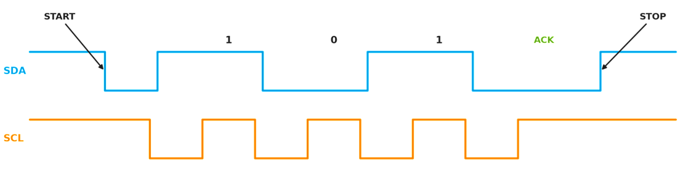
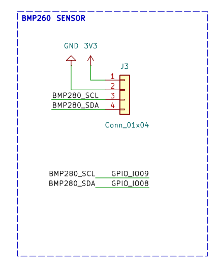

.. _i2c-bus-and-the-bmp280-sensor-driver:

I2C Bus and the BMP280 Sensor Driver
=====================================

Slides: :download:`here <../_static/content/slides/2026/slides_day4.pdf>`

Theory
------

I2C Protocol Fundamentals
~~~~~~~~~~~~~~~~~~~~~~~~~~~

So far (UART, GPIO) each wire carried data in a single direction. **I2C**
(Inter-Integrated Circuit) is different: many chips share the same **two wires**, and the
data line (``SDA``) is *bidirectional*, carrying bytes in both directions at different
points in a transfer. Sharing one bus instead of a dedicated link per chip is why almost
every sensor, EEPROM (Electrically Erasable Programmable Read-Only Memory), RTC (Real Time
Clock) and power-management chip on a board uses I2C.

**The two wires**

- ``SCL`` – Serial **CL**\ ock. Driven by the **controller** (formerly called the
  *master*) — the device that starts a transfer and provides the clock (here, the i.MX93). Every
  bit is sampled on a clock edge.
- ``SDA`` – Serial **DA**\ ta. Used to transmit data, one bit at a time.

Devices on the bus must use **open-drain** (or **open-collector**) outputs so they can
perform the wired-AND function. Such an output can only pull the line low; it can never
drive it high. To make a line go high, the bus relies on external **pull-up resistors**
(commonly around 4.7 kΩ) that pull the idle line up to the supply voltage (here, 3.3 V).

Why go through this trouble instead of normal push-pull outputs? Three reasons:

1. **No short circuits.** If two devices talk at once, the worst that happens is that
   the line is pulled low by one of them. With push-pull outputs, one chip driving high
   while another drives low would lead to a short circuit.
2. **Wired-AND logic.** Because *anyone* can pull the line low but the pull-up alone
   makes it high, the bus level is the logical AND of all participants. The line is high
   only if *every* device lets go of it. This single property is the foundation of
   acknowledgement, arbitration and clock stretching below.
3. **Multi-controller and many targets on the same two pins.** A **target** (formerly
   called a *slave*) is a device the controller talks to; targets are distinguished by
   *address*, not by extra wires.

**Addresses**

Each device on the bus has a unique **7-bit address** (0x00–0x7F, so up to 128 devices
in theory; some addresses are reserved, so fewer in practice). The address is *baked
into the chip*; many chips let you change one or two low address bits by tying a select
pin to GND or VDDIO — exactly what the BMP280’s SDO pin does above — so you can put two
identical chips on one bus.

The BMP280's address is selected by the **SDO pin**:

- SDO tied to **GND**   → address ``0x76``
- SDO tied to **VDDIO** → address ``0x77``

In this lab we wire SDO to GND, so the sensor lives at ``0x76``.

**Anatomy of a transaction**

Every transfer is framed by two special bus conditions that are *only* legal here:

- **START**: SDA goes low *while SCL is high*. "I'm taking the bus."
- **STOP**:  SDA goes high *while SCL is high*. "I'm done, bus is free."

During normal data bits, SDA is only ever changed while SCL is *low* and is sampled
while SCL is *high*; the high-SCL transitions are reserved for START/STOP precisely so
they can't be confused with data.

The waveform below shows three data bits. SDA settles to its value while SCL is low and
then holds steady through the SCL-high pulse, where the receiver samples it (``‾`` = high,
``_`` = low):

.. _i2c_transaction:

START and STOP break that rule on purpose: they are the *only* times SDA moves while SCL
is high, which is exactly what makes them unambiguous frame markers:

A complete transaction looks like::

    START → [7-bit address][R/W bit] → ACK → [data] → ACK → ... → STOP

After every 8 bits, the **receiver** pulls SDA low for one clock to acknowledge the
byte (**ACK**); leaving the line high instead is a **NACK**, indicating the byte was
not accepted or no further data is wanted. The controller uses a NACK on the last byte
of a read to tell the target to stop sending.

**Writing to a register**

To write one byte to a register inside a chip, the controller sends:

1. START
2. device address + **W** (write) bit
3. the *register address* inside the chip (which internal byte we mean)
4. the data byte
5. STOP

**Reading from a register**

You cannot just "read register 0xD0" in one shot, because the chip has no idea which
register you mean until you tell it. So a register read is really a *write followed by a
read*:

1. START
2. device address + **W** → write the register address (this is the "dummy write": no
   data, it just sets the chip's internal pointer)
3. **repeated START** (a second START with no STOP in between — keeps the bus, switches
   direction)
4. device address + **R** (read) bit
5. read the data byte(s); the controller ACKs each byte except the last, which it **NACKs**
6. STOP

You don't normally code this by hand — the kernel's SMBus helpers (next section) do it
for you — but understanding the shape explains *why* the API has separate "register" and
"raw" calls.

**Bus speeds**

- Standard mode: 100 kHz
- Fast mode: 400 kHz  ← what we use in this lab
- Fast mode plus: 1 MHz

Speed is limited by the pull-up strength and bus capacitance: weaker pull-ups and long
traces mean slower edges, which caps the usable clock.

**Clock stretching**

A slow target that isn't ready can *hold SCL low* even though the controller released it.
Thanks to wired-AND, the clock simply can't rise until the target lets go, so the
controller automatically waits. This is called **clock stretching** and it lets a fast
controller talk to a slow device without any handshake protocol on top.

**On the i.MX93**

The i.MX93 implements I2C with the **LPI2C** (Low-Power I2C) controller — it has several
instances (LPI2C1…LPI2C8). Each one becomes a Linux ``i2c_adapter`` (a numbered bus
under ``/sys/bus/i2c/devices/``). Exactly one of these LPI2C instances is routed to the
SCL/SDA pins on the **EXT2 expansion header** where you'll wire the BMP280; figuring out
*which* one is your first lab exercise.

The Linux I2C Subsystem
~~~~~~~~~~~~~~~~~~~~~~~~~

Linux splits I2C into **three layers** so that a sensor driver never has to know how the
SoC's I2C hardware actually toggles wires:

::

    +---------------------------+   your code (Day 4)
    |  i2c_driver / i2c_client  |   "read register 0xD0 from the BMP280"
    +---------------------------+
    |        I2C core           |   generic transfer engine, SMBus emulation
    +---------------------------+
    |  i2c_adapter (controller) |   the LPI2C driver: actually drives SCL/SDA signals
    +---------------------------+
              hardware bus

- The **controller (adapter) driver** knows the LPI2C registers and produces real bus
  traffic. NXP already wrote this; you never touch it.
- The **I2C core** is the glue. It matches devices to drivers, and crucially it can
  *emulate* the SMBus transactions (the write-then-read dance above) on top of the
  adapter's raw transfer. That is why you can call one tidy function and get a correct
  register read.
- Your **device driver** is an ``i2c_driver``. When a device that matches it appears on
  a bus, the core hands you an ``i2c_client`` — a handle representing *that one chip at
  that one address* — and calls your ``probe()``.

The three structures, in one breath: an ``i2c_adapter`` *is a bus*, an ``i2c_client``
*is a device on a bus*, and an ``i2c_driver`` *is the code that drives such devices*.

**SMBus vs. raw I2C.** SMBus is a strict subset of I2C with defined transaction shapes
(read byte from register, write byte to register, block read, …). The ``i2c_smbus_*``
helpers below are almost always what you want for a register-mapped sensor like the
BMP280, because they handle the dummy-write/repeated-START for you. The ``i2c_master_*``
helpers give you raw byte-level control for the rare device that doesn't fit the SMBus
pattern.

.. list-table::
   :header-rows: 1
   :widths: 35 65

   * - API
     - Purpose
   * - ``struct i2c_client``
     - Represents one I2C device; holds ``addr``, ``adapter``, ``dev``
   * - ``i2c_smbus_read_byte_data(client, reg)``
     - Read one byte from register ``reg``
   * - ``i2c_smbus_write_byte_data(client, reg, val)``
     - Write one byte to register ``reg``
   * - ``i2c_smbus_read_i2c_block_data(client, reg, len, buf)``
     - Burst-read ``len`` bytes starting at ``reg``
   * - ``i2c_master_send(client, buf, count)``
     - Raw write of ``count`` bytes (no SMBus framing)
   * - ``i2c_master_recv(client, buf, count)``
     - Raw read of ``count`` bytes

.. note::

   This lab uses the current I2C terminology — **controller** and **target** (the 2021
   spec renamed the older *master* and *slave*). The Linux kernel API, however, still
   carries the historical names: you will see ``i2c_master_send`` / ``i2c_master_recv``
   and the ``i2c_master_*`` family. They mean "controller-side", so don't let the spelling
   confuse you.

.. note::

   Every ``i2c_smbus_read_*`` call returns a **signed** value: a non-negative result is
   your data, a **negative** result is a ``-errno`` error code. *Always check for
   ``< 0`` before using the value* — a disconnected SDA wire shows up here, not as a
   crash.

Device Tree: I2C Nodes and Sensor Bindings
~~~~~~~~~~~~~~~~~~~~~~~~~~~~~~~~~~~~~~~~~~~~

I2C devices cannot be auto-detected reliably (probing random addresses can upset other
chips), so on an embedded SoC we *declare* them in the **device tree**. The controller
appears as a node; each chip on the bus appears as a **child** of that controller node.
The parent/child nesting is what tells the kernel "this BMP280 lives on *this* bus."

Three properties do the heavy lifting:

- ``reg`` — the device's **7-bit I2C address** (without the R/W bit). For the BMP280 with
  SDO->GND this is ``0x76``.

.. note::
  ``reg`` means "address on the parent bus"; on an I2C bus that's the I2C address, on a memory-mapped bus it would be a base address.

- ``clock-frequency`` — the SCL speed for the *whole bus* (``400000`` = Fast mode).
- ``status`` — ``"okay"`` enables the node; ``"disabled"`` turns it off. SoC ``.dtsi``
  files ship most buses ``disabled``; the board ``.dts`` flips on the ones it uses.

The ``#address-cells = <1>`` / ``#size-cells = <0>`` on the controller say "my children
are addressed by a single number and have no size" — i.e. an I2C address.

The ``pinctrl-0`` / ``pinctrl-names`` properties hand the SCL/SDA pads to the controller;
the actual pad-to-function mapping lives in an ``iomuxc`` group.

.. code-block:: devicetree

   &lpi2cX {      /* Enable LPI2C7 (Exercise 1); add the bmp280 child in Exercise 3 */
       #address-cells = <1>;
       #size-cells = <0>;
       clock-frequency = <400000>;    /* Fast mode: 400 kHz */
       pinctrl-0 = <&pinctrl_lpi2cX>;
       pinctrl-names = "default";
       status = "okay";

       bmp280: pressure@76 {
           compatible = "lkss,bmp280";
           reg = <0x76>;              /* I2C address: SDO tied to GND */
           /* vddd-supply = <&reg_3v3>; optional regulator reference */
       };
   };

   &iomuxc {
       pinctrl_lpi2cX: lpi2cX-grp {
           fsl,pins = <
               /* Example i.MX93 entries — CONFIRM the pad names and the
                * mux/config value against the i.MX93 Reference Manual IOMUX
                * table and the FRDM-IMX93 schematic for the EXT2 header.
                * Format:  <PAD_MACRO  config_value>
                * Example (LPI2C7 on the GPIO_IO pads):
                *   MX93_PAD_GPIO_IO08__LPI2C7_SDA   0x40000b9e
                *   MX93_PAD_GPIO_IO09__LPI2C7_SCL   0x40000b9e
                * The 0x...b9e value enables the internal pull-up and open-drain;
                * I2C pads must be open-drain.
                */
           >;
       };
   };

.. note::

   ``compatible`` is the matchmaker. The string ``"lkss,bmp280"`` in the device tree
   must appear *verbatim* in your driver's ``of_match_table`` (Exercise 3) for the
   kernel to bind your driver to this node. ``vendor,device`` is the naming convention;
   we use the fake vendor ``lkss`` so we never collide with the real upstream
   ``bosch,bmp280`` binding.

The BMP280 Sensor
~~~~~~~~~~~~~~~~~~

The **BMP280** is a Bosch digital **barometric pressure and temperature** sensor in a
tiny package. Internally it has an analog front-end that measures pressure and
temperature, two ADCs that turn those into 20-bit raw numbers, and a register file you
talk to over I2C (or SPI). It needs the temperature reading to correct the pressure
reading, which is why we always read both.

For details check the `datasheet <https://www.bosch-sensortec.com/media/boschsensortec/downloads/datasheets/bst-bmp280-ds001.pdf>`_

You interact with it entirely through its **register map**. Three groups matter:

1. **Identity / control** — who am I (``id``), reset me (``reset``), how should I measure
   (``ctrl_meas``, ``config``), am I busy (``status``).
2. **Calibration** — 24 bytes of per-chip factory constants at ``0x88``. Every
   individual sensor is trimmed at the factory and stores its own coefficients; you must
   read them and feed them into the compensation maths.
3. **Raw output** — the most recent 20-bit pressure and temperature ADC samples.

.. list-table::
   :header-rows: 1
   :widths: 15 15 70

   * - Register
     - Address
     - Purpose
   * - ``id``
     - 0xD0
     - Chip ID — always reads ``0x58`` for BMP280
   * - ``reset``
     - 0xE0
     - Write ``0xB6`` to trigger a soft reset
   * - ``status``
     - 0xF3
     - Bit 3: ``measuring``; bit 0: ``im_update``
   * - ``ctrl_meas``
     - 0xF4
     - Oversampling for temperature/pressure, power mode
   * - ``config``
     - 0xF5
     - Standby time, IIR filter coefficient, SPI 3-wire mode
   * - ``press_msb/lsb/xlsb``
     - 0xF7–0xF9
     - Raw 20-bit ADC pressure value
   * - ``temp_msb/lsb/xlsb``
     - 0xFA–0xFC
     - Raw 20-bit ADC temperature value
   * - ``calib00–calib23``
     - 0x88–0x9F
     - 24 bytes of factory calibration coefficients

.. note::

   The address range ``0x88–0x9F`` is exactly **24 bytes** (``0x9F − 0x88 + 1 = 24``).
   That holds the 12 16-bit coefficients ``dig_T1..T3`` and ``dig_P1..P9``. The
   BMP280's bigger sibling, the BME280, adds humidity coefficients above ``0x9F``; on a
   plain BMP280 there is nothing useful past ``0x9F``, so we read 24 bytes, not 26.

**Power modes.** The chip has *sleep*, *normal* (free-running) and *forced* modes. We use
**forced mode**: write ``ctrl_meas`` once, the chip takes a single measurement, then
drops back to sleep. This is the natural fit for "read a sensor on demand" and keeps
power use trivial.

Calibration and Compensation
~~~~~~~~~~~~~~~~~~~~~~~~~~~~~~

The raw ADC values are *not* temperature or pressure. They are uncalibrated counts whose
relationship to real physical units differs slightly from chip to chip because of
manufacturing tolerances. To get usable numbers you combine the raw value with that
chip's own calibration coefficients using fixed formulas published by Bosch (datasheet
section 3.11.3).

Bosch ships these as **integer-only** formulas so they run on MCUs with no FPU — which is
exactly why we can run them in kernel space, where floating point is forbidden. The
maths looks intimidating; you do not need to *derive* it, only to *transcribe it
faithfully* and respect the integer widths (``s32`` vs ``s64``). One wrong shift or a
``32`` where a ``64`` was needed silently corrupts the result.

The 24 calibration bytes decode (little-endian) into:

- ``dig_T1`` (``u16``), ``dig_T2`` (``s16``), ``dig_T3`` (``s16``)
- ``dig_P1`` (``u16``), ``dig_P2``…``dig_P9`` (``s16`` each)

**Temperature compensation** — note the side effect: it computes ``t_fine``, a
high-resolution intermediate that the *pressure* formula then consumes. Always run the
temperature compensation first.

.. code-block:: c

   /* All locals are s32 (signed 32-bit). adc_T is the raw 20-bit temperature.
    * Returns temperature in hundredths of a degree C (5123 == 51.23 degC),
    * and writes t_fine through the pointer for the pressure stage to use.   */
   s32 bmp280_compensate_temp(struct bmp280_calib *c, s32 adc_T, s32 *t_fine)
   {
       s32 var1, var2;

       var1 = ((((adc_T >> 3) - ((s32)c->dig_T1 << 1))) * ((s32)c->dig_T2)) >> 11;
       var2 = (((((adc_T >> 4) - (s32)c->dig_T1) *
                 ((adc_T >> 4) - (s32)c->dig_T1)) >> 12) * (s32)c->dig_T3) >> 14;
       *t_fine = var1 + var2;
       return (*t_fine * 5 + 128) >> 8;   /* 0.01 degC units */
   }

**Pressure compensation** — this is the full Bosch 64-bit integer formula. Intermediate
products overflow 32 bits, so every working variable is ``s64``.

.. code-block:: c

   /* adc_P is the raw 20-bit pressure; t_fine comes from the temperature stage.
    * Returns pressure in Q24.8 fixed point: result / 256 == pressure in Pa.
    * Example: 24674867 -> 24674867 / 256 = 96386 Pa = 963.86 hPa.            */
   u32 bmp280_compensate_press(struct bmp280_calib *c, s32 adc_P, s32 t_fine)
   {
       s64 var1, var2, p;

       var1 = ((s64)t_fine) - 128000;
       var2 = var1 * var1 * (s64)c->dig_P6;
       var2 = var2 + ((var1 * (s64)c->dig_P5) << 17);
       var2 = var2 + (((s64)c->dig_P4) << 35);
       var1 = ((var1 * var1 * (s64)c->dig_P3) >> 8) +
              ((var1 * (s64)c->dig_P2) << 12);
       var1 = (((((s64)1) << 47) + var1)) * ((s64)c->dig_P1) >> 33;

       if (var1 == 0)
           return 0;       /* avoid divide-by-zero */

       p = 1048576 - adc_P;
       p = (((p << 31) - var2) * 3125) / var1;
       var1 = (((s64)c->dig_P9) * (p >> 13) * (p >> 13)) >> 25;
       var2 = (((s64)c->dig_P8) * p) >> 19;
       p = ((p + var1 + var2) >> 8) + (((s64)c->dig_P7) << 4);

       return (u32)p;       /* Q24.8 Pa */
   }

To turn the Q24.8 result into **hPa**: ``pressure_Pa = p / 256``, and
``1 hPa = 100 Pa``, so ``hPa = p / 25600``. Keep the remainder if you want the two
decimal places (``1013.25``); see Exercise 6.

Sysfs Attributes
~~~~~~~~~~~~~~~~~

A driver's job is only half done when it can read the sensor in ``probe``; the *user*
needs the numbers too. The simplest way to publish a value to userspace is a **sysfs
attribute** — a virtual file under ``/sys`` that runs a callback in your driver each time
it is read.

The pieces:

- ``DEVICE_ATTR_RO(name)`` declares a **read-only** attribute backed by a function you
  write called ``name_show()``. (There is also ``DEVICE_ATTR_RW`` for writable ones.)
- The ``show`` callback has the signature
  ``ssize_t name_show(struct device *dev, struct device_attribute *attr, char *buf)``.
  You format your text into ``buf`` and **return the number of bytes written**, almost
  always via ``sysfs_emit(buf, "...")``.
- Multiple attributes are bundled into a ``struct attribute_group`` and registered in one
  go with ``sysfs_create_group(&client->dev.kobj, &grp)`` in ``probe`` — and torn down
  with ``sysfs_remove_group()`` in ``remove``.

Reading the file triggers a *fresh* measurement on demand, so the flow inside ``show``
is: trigger forced-mode → wait → read raw → compensate → ``sysfs_emit`` the formatted
result. Each open/read is one measurement, which is exactly the on-demand behaviour we
want.

Introduction to the IIO Subsystem
~~~~~~~~~~~~~~~~~~~~~~~~~~~~~~~~~~~

Manually creating a ``temperature`` and a ``pressure`` sysfs file works, but every driver
author would invent their own file names, units and layout — and userspace tools would
have to special-case each one. The kernel solves this with **IIO (Industrial I/O)**, the
*standard* framework for sensors that produce analog-ish data: ADCs, accelerometers,
gyros, light, pressure, temperature, and so on.

What IIO gives you for free:

- A consistent layout at ``/sys/bus/iio/devices/iio:deviceX/``.
- **Standard channel names** with defined units, e.g. ``in_pressure_input`` (kPa) and
  ``in_temp_input`` (milli-°C), plus ``*_raw`` / ``*_scale`` conventions so a generic app
  can read *any* IIO sensor without knowing the chip.
- Buffered/triggered capture, timestamps, and tools like ``iio_info`` and
  ``libiio`` that work across all IIO devices.

The trade-off is abstraction: an IIO driver describes its sensor through
``iio_chan_spec`` tables and ``read_raw`` callbacks rather than reading registers in
``probe``. That structure is great in production but it hides the very I2C mechanics this
lab is about.

So for Day 4 we deliberately write a **plain sysfs driver**: you see every register read
and every transaction with nothing in the way. The real upstream driver lives in
``drivers/iio/pressure/bmp280-core.c`` (with the I2C glue in ``bmp280-i2c.c``) and *is*
an IIO driver — read it after the lab to see how the same chip is handled "properly".

Cheatsheet: I2C and BMP280 APIs
~~~~~~~~~~~~~~~~~~~~~~~~~~~~~~~~~

.. list-table::
   :header-rows: 1
   :widths: 45 55

   * - Function / Macro
     - Purpose
   * - ``i2c_smbus_read_byte_data(client, reg)``
     - Read one byte from register ``reg``; returns the byte or ``< 0`` on error
   * - ``i2c_smbus_write_byte_data(client, reg, val)``
     - Write one byte to register ``reg``
   * - ``i2c_smbus_read_i2c_block_data(client, reg, len, buf)``
     - Burst-read ``len`` bytes starting at ``reg`` into ``buf``
   * - ``i2c_set_clientdata(client, data)``
     - Store driver private data pointer in the ``i2c_client``
   * - ``i2c_get_clientdata(client)``
     - Retrieve driver private data pointer
   * - ``get_unaligned_le16(ptr)``
     - Read a little-endian 16-bit value from an unaligned byte pointer
   * - ``sysfs_emit(buf, fmt, ...)``
     - Format a sysfs ``show`` reply safely into ``buf``; return its length
   * - ``DEVICE_ATTR_RO(name)``
     - Declare a read-only sysfs attribute; implement ``name_show()``
   * - ``sysfs_create_group(kobj, grp)``
     - Register a group of sysfs attributes
   * - ``devm_kzalloc(dev, size, gfp)``
     - Allocate zeroed memory freed automatically when the device unbinds
   * - ``module_i2c_driver(drv)``
     - Register + unregister an ``i2c_driver`` in one macro

Lab exercises
-------------

.. note::

   Exercises for this lab can be found in ``drivers/lkss/lab4``. You are given a
   code skeleton (``bmp280.c``) with blocks marked ``TODO``; each exercise tells
   you which block to complete.

Prerequisites
~~~~~~~~~~~~~~

#. Go over the cheatsheet :ref:`here <lkss_cheatsheet>`.

#. Make sure you connect the accessory board as described :ref:`here <lkss-daughter-board-module-connection>`. You can download its schematic from the :ref:`Design files <lkss_daughter_board_design_files>`.

#. Make sure to enable **CONFIG_LKSS_DRIVERS_LAB4** and the related configs in the **menuconfig** before compiling a new exercise.

1. Enable the I2C controller (easy)
~~~~~~~~~~~~~~~~~~~~~~~~~~~~~~~~~~~~~

**Description**

.. _bmp280_schematic:

The schematic above shows that the BMP280 on the EXT2 header is wired to the **LPI2C7** controller (pads
``GPIO_IO08`` = SDA, ``GPIO_IO09`` = SCL - see `arch/arm64/boot/dts/freescale/imx93-pinfunc.h <https://elixir.bootlin.com/linux/v7.1.2/source/arch/arm64/boot/dts/freescale/imx93-pinfunc.h#L103>`__). That controller ships **disabled** in the SoC
``.dtsi`` (see `arch/arm64/boot/dts/freescale/imx91_93_common.dtsi <https://elixir.bootlin.com/linux/v7.1.2/source/arch/arm64/boot/dts/freescale/imx91_93_common.dtsi#L821>`__), so Linux has no bus for the sensor to live on and nothing can be scanned yet.
Your first job is to enable the controller — *without* adding the sensor itself.

**Steps**

- Open the FRDM board DTS file
  ``arch/arm64/boot/dts/freescale/imx93-11x11-frdm.dts``.
- Add an ``&lpi2c7`` **override**: set ``status = "okay"``, the bus speed and a pinctrl
  group. Do **not** redefine the controller — ``reg``, ``clocks``, ``interrupts`` and
  ``dmas`` already live in the ``.dtsi``; your override merges into that node. Do **not**
  add the sensor child node yet (that is Exercise 3).

  .. code-block:: devicetree

     &lpi2c7 {
         clock-frequency = <400000>;       /* Fast mode: 400 kHz */
         pinctrl-names = "default";
         pinctrl-0 = <&pinctrl_lpi2c7>;
         status = "okay";
     };

     &iomuxc {
         pinctrl_lpi2c7: lpi2c7grp {
             fsl,pins = <
                 MX93_PAD_GPIO_IO08__LPI2C7_SDA   0x40000b9e
                 MX93_PAD_GPIO_IO09__LPI2C7_SCL   0x40000b9e
             >;
         };
     };

- Rebuild the DTB and boot.

  .. code-block:: bash

     python3 compile --install-modules
     python3 scripts/lkss.py boot

- Confirm a **new** adapter appeared. LPI2C7 is at register base ``0x426d0000``; find
  which Linux ``i2c-N`` that maps to.

  .. code-block:: bash

     i2cdetect -l

- Think about it: why does enabling the controller create a *bus* (a new ``i2c-N``) but
  no *device* on it yet?

.. note::

   The Linux bus number (``i2c-3``) is **not** the LPI2C instance number (``lpi2c7``).
   Match the controller by its register base in ``i2cdetect -l`` (``426d0000.i2c``), then
   use whatever ``i2c-N`` it was given for the scans below.

.. hint::

   The pad-config value ``0x40000b9e`` selects open-drain with an internal pull-up, which
   I2C requires. Confirm it against an existing ``pinctrl_lpi2c*`` group already in the
   NXP i.MX93 DTS for your kernel; copy the value the BSP uses rather than trusting it
   blindly. Also check that nothing else in the board DTS already muxes ``GPIO_IO08`` /
   ``GPIO_IO09`` — a second user of those pads is a pinmux conflict.

2. Scan the bus and read the chip ID (easy)
~~~~~~~~~~~~~~~~~~~~~~~~~~~~~~~~~~~~~~~~~~~~~

**Description**

With the bus up but **no driver bound yet**, verify the BMP280 is electrically connected
and read its identity by hand. This is your one chance to talk to the raw chip: once the
driver binds in Exercise 3, the kernel will claim the address and these tools stop working
(see the note there).

**Steps**

- List the I2C devices and buses; identify the ``i2c-N`` for ``426d0000.i2c`` from
  Exercise 1.

  .. code-block:: bash

     ls /sys/bus/i2c/devices/

- Scan that bus with ``i2cdetect``. You should see a plain address ``0x76`` (or ``0x77``
  if SDO is tied high).

  .. code-block:: bash

     i2cdetect -y <bus_number>

- Manually read the chip ID register (``0xD0``) with ``i2cget`` and confirm the returned
  value is ``0x58``.

  .. code-block:: bash

     i2cget -y <bus_number> 0x76 0xD0

- Dump all BMP280 registers with ``i2cdump -y <bus_number> 0x76``.
- Think about it: why does ``i2cdetect`` use write-probes rather than read-probes, and
  what does the ``0x58`` chip ID tell you?

.. hint::

   A *read* of a random register can change state in some chips (advance an internal
   pointer, clear a flag, trigger an action). A 0-byte *write* just checks for an ACK at
   that address and is far less likely to disturb a device. The ``0x58`` value is the
   fixed BMP280 ``id`` — getting it back proves the wiring is correct *and* that you
   really have a BMP280 (a BME280 returns ``0x60``, a BMP180 returns ``0x55``).

**Demo commands**

.. code-block:: bash

   $ i2cdetect -y 3
        0  1  2  3  4  5  6  7  8  9  a  b  c  d  e  f
   70: -- -- -- -- -- -- 76 --

   $ i2cget -y 3 0x76 0xD0
   0x58

3. Add the sensor node and a minimal driver (medium)
~~~~~~~~~~~~~~~~~~~~~~~~~~~~~~~~~~~~~~~~~~~~~~~~~~~~~~~

**Description**

Now declare the BMP280 in the device tree and write a driver skeleton that binds to it.
Adding the child node plus a matching driver is what makes the kernel *claim* the address.

**Steps**

- Open the FRDM board DTS file ``arch/arm64/boot/dts/freescale/imx93-11x11-frdm.dts``. In the same ``&lpi2c7`` node from Exercise 1, add the ``bmp280`` child:

  .. code-block:: devicetree

     &lpi2c7 {
         /* ...properties from Exercise 1... */

         bmp280: pressure@76 {
             compatible = "lkss,bmp280";
             reg = <0x76>;              /* SDO tied to GND */
         };
     };

- Open ``drivers/lkss/labs/lab4/bmp280.c`` (the skeleton).
- Complete ``TODO 1``: fill in the ``of_match_table`` with the ``"lkss,bmp280"``
  compatible string and an ``i2c_device_id`` table entry for ``"bmp280"``.
- Complete ``TODO 2`` (``probe``): print a bind message.

  .. code-block:: c

     dev_info(&client->dev, "BMP280 driver bound at address 0x%02x\n",
              client->addr);

- Complete ``TODO 3`` (``remove``): print a goodbye message.
- Enable the driver in menuconfig (``CONFIG_LKSS_DRIVERS_LAB4``), build, install and boot.
- Insert the module ``bmp280`` using ``modprobe``.
- Verify on the board with ``dmesg | grep bmp280``.

.. note::

   Once your driver binds, ``i2cdetect`` shows **``UU``** at ``0x76`` instead of ``76``,
   and ``i2cget`` / ``i2cdump`` fail with *"Device or resource busy"*. This is **expected
   and correct**: the kernel refuses to let userspace poke a register behind a bound
   driver's back. ``UU`` is proof your driver matched. (For a quick one-off raw read you
   can force it with ``i2cget -y -f <bus> 0x76 0xD0``, but don't do this while the driver
   is actively sampling.)

.. hint::

   If ``probe`` never runs, the ``compatible`` string in the DTS and in
   ``of_match_table`` don't match *exactly* — check for typos and the trailing ``{ }``
   sentinel that terminates the table. ``module_i2c_driver(bmp280_driver)`` generates the
   module init/exit for you; you do not write ``module_init`` / ``module_exit`` by hand.

4. Read the chip ID register (medium)
~~~~~~~~~~~~~~~~~~~~~~~~~~~~~~~~~~~~~~~

**Description**

Verify SDA/SCL wiring is correct by reading the known chip ID.

**Steps**

- Complete ``TODO 4`` in ``probe``: read register ``0xD0``.

  .. code-block:: c

     int id = i2c_smbus_read_byte_data(client, BMP280_REG_ID);
     if (id < 0) {
         dev_err(&client->dev, "Failed to read chip ID: %d\n", id);
         return id;
     }
     dev_info(&client->dev, "Chip ID: 0x%02x (expected 0x58)\n", id);
     if (id != BMP280_CHIP_ID)
         return -ENODEV;

- Rebuild, boot, insert the module and verify the correct chip ID appears in ``dmesg``.
- Think about it: what happens to ``id`` if you unplug the SDA wire and re-run? Why is
  checking ``id < 0`` not optional?

5. Configure the sensor and read raw ADC values (medium)
~~~~~~~~~~~~~~~~~~~~~~~~~~~~~~~~~~~~~~~~~~~~~~~~~~~~~~~~~~~

**Description**

Configure the BMP280 for forced-mode measurement and read the raw ADC output registers.
Look into `BMP280 specific registers <https://elixir.bootlin.com/linux/v7.1.2/source/drivers/iio/pressure/bmp280.h#L216>`__

**Steps**

- Complete ``TODO 5`` — ``bmp280_trigger_measurement(client)``: write ``ctrl_meas``
  (0xF4) = ``0x27`` (temperature oversampling ×1 in bits 7:5 = 001, pressure oversampling
  ×1 in bits 4:2 = 001, forced mode in bits 1:0 = 01). Forced mode triggers one
  measurement and then returns to sleep. Use `i2c_smbus_write_byte_data <https://elixir.bootlin.com/linux/v7.1.2/source/drivers/i2c/i2c-core-smbus.c#L150>`__
- Complete ``TODO 6`` — ``bmp280_read_raw(client, adc_t, adc_p)``: burst-read 6 bytes
  starting at ``0xF7`` (``press_msb``).

  .. code-block:: c

     u8 buf[6];
     ret = i2c_smbus_read_i2c_block_data(client, BMP280_REG_PRESS_MSB, 6, buf);
     if (ret < 0)
         return ret;
     *adc_p = ((s32)buf[0] << 12) | ((s32)buf[1] << 4) | (buf[2] >> 4);
     *adc_t = ((s32)buf[3] << 12) | ((s32)buf[4] << 4) | (buf[5] >> 4);

- Call both from ``probe`` (with an ``msleep(10)`` between trigger and read so the
  measurement can finish) and print the raw values. Look into ``bmp280_measure`` function from lab skeleton code.
- Rebuild, boot, insert the module and verify the temperature and pressure raw values appear in ``dmesg``.
- Note that the mode bits revert to ``00`` after each forced measurement, so every new
  sample needs a fresh ``ctrl_meas`` write.
- Think about it: the pressure value occupies the *first* 3 bytes of the burst and
  temperature the *last* 3. Why is it efficient to read them in a single 6-byte block
  rather than two separate reads?

.. hint::

   The ``xlsb`` registers only use their top 4 bits (oversampling ×1), hence the ``>> 4``
   on the third byte of each value and the 12/4/0 shift pattern that rebuilds the 20-bit
   number.

6. Read calibration data and apply compensation (hard)
~~~~~~~~~~~~~~~~~~~~~~~~~~~~~~~~~~~~~~~~~~~~~~~~~~~~~~~~~

**Description**

Parse the factory calibration registers and compute temperature (°C) and pressure (hPa)
from the raw ADC values.

**Steps**

- ``TODO 7`` — the ``struct bmp280_calib`` is given in the skeleton with the correct
  field types (``dig_T1`` u16, ``dig_T2/T3`` s16, ``dig_P1`` u16, ``dig_P2..P9`` s16).
  Make sure you understand why the signedness matters.
- Complete ``TODO 8`` — ``bmp280_read_calib(client, calib)``: burst-read 24 bytes
  starting at ``0x88`` (``BMP280_REG_CALIB00``) and parse little-endian 16-bit values with
  ``get_unaligned_le16()`` at the right offsets (T1 @ 0, T2 @ 2, T3 @ 4, P1 @ 6, …,
  P9 @ 22).
- Complete ``TODO 9`` — ``bmp280_compensate_temp()`` using the formula from Theory; return
  temperature in 0.01 °C and write ``t_fine`` out.
- Complete ``TODO 10`` — ``bmp280_compensate_press()`` using the full 64-bit formula from
  Theory; returns Q24.8 Pa.
- In ``probe``, read the calibration once, take a sample, compensate and print both values
  with their fractional part. Pay attention to ``struct bmp280_data`` (holding client, calib and t_fine) which is defined in the skeleton.

  .. code-block:: c

     s32 temp = bmp280_compensate_temp(&calib, adc_t, &t_fine);  /* 0.01 degC */
     u32 praw = bmp280_compensate_press(&calib, adc_p, t_fine);  /* Q24.8 Pa  */
     u32 phpa = praw / 256;                /* Pa  */
     dev_info(&client->dev,
              "temperature = %d.%02d degC, pressure = %u.%02u hPa\n",
              temp / 100, abs(temp % 100),
              phpa / 100, phpa % 100);

- Rebuild, boot, insert the module and verify the temperature and pressure values appear in ``dmesg``.
- Think about it: if you accidentally declare ``dig_T2`` as ``u16`` instead of ``s16``,
  the temperature comes out wildly wrong on a cold day but looks fine on a warm one — why?
  And why must the pressure formula use ``s64`` intermediates (estimate how large
  ``(p << 31)`` gets and compare to the ``s32`` range)?

.. hint::

   ``get_unaligned_le16(buf + n)`` returns a ``u16``; cast to ``s16`` *before* storing
   into the signed fields so sign-extension happens correctly. Read calibration **once**
   in ``probe`` and cache it — it never changes — rather than re-reading on every sample.

**Demo output**

.. code-block:: bash

   $ dmesg | grep BMP280
   [   12.345678] BMP280: temperature = 25.34 degC, pressure = 1013.25 hPa

7. Expose readings via sysfs (hard)
~~~~~~~~~~~~~~~~~~~~~~~~~~~~~~~~~~~~~

**Description**

Make temperature and pressure readable from userspace through sysfs attributes that
trigger a fresh measurement on each read.

**Steps**

- ``TODO 11`` — the ``struct bmp280_data`` (holding ``client``, ``calib`` and ``t_fine``)
  is defined in the skeleton. In ``probe``, allocate it with ``devm_kzalloc()``, fill it
  in and store it with ``i2c_set_clientdata()``.
- ``TODO 12`` — define two ``DEVICE_ATTR_RO`` attributes, ``temperature`` and
  ``pressure``, and put them in a ``struct attribute_group``.
- ``TODO 13`` — in each ``show`` callback: recover your data with
  ``i2c_get_clientdata()`` / `dev_get_drvdata(dev) <https://elixir.bootlin.com/linux/v7.1.2/source/include/linux/device.h#L925>`__.
  Trigger a forced-mode measurement; wait for completion (poll the ``status`` register (0xF3) bit 3, or simply
  ``msleep(10)``); read the raw ADC values and apply compensation - for all these steps look into ``bmp280_measure`` function from lab skeleton code.
  Return the formatted result with ``sysfs_emit(buf, "%d.%02d\n", ...)``.
- ``TODO 14`` — register the group with ``sysfs_create_group()`` in ``probe`` and remove
  it with ``sysfs_remove_group()`` in ``remove``.
- Rebuild, boot, insert the module.
- On the board, ``cat`` the two attributes.
- Think about it: where does the conversion to ASCII happen, and why is ``sysfs_emit``
  preferred over ``sprintf``? If two processes ``cat`` the file at the same time, two
  forced measurements may interleave on the bus — is that a correctness problem here,
  when *would* it become one, and what would you add? (Think: a lock around trigger+read.)

.. hint::

   ``DEVICE_ATTR_RO(temperature)`` expects a function named exactly ``temperature_show``.
   The ``dev`` passed to ``show`` is ``&client->dev``; use ``dev_get_drvdata(dev)`` (or
   ``i2c_get_clientdata(to_i2c_client(dev))``) to get your struct back.

**Demo commands**

.. code-block:: bash

   $ cat /sys/bus/i2c/devices/3-0076/temperature
   25.34
   $ cat /sys/bus/i2c/devices/3-0076/pressure
   1013.25

8. Periodic sampling with a kernel timer (bonus)
~~~~~~~~~~~~~~~~~~~~~~~~~~~~~~~~~~~~~~~~~~~~~~~~~~

**Description**

Use the kernel timer API (from Day 1, Exercise 5) to sample the BMP280 every second and
log the readings to the kernel log.

**Steps**

- ``TODO 15`` — add a ``struct timer_list poll_timer`` and a ``struct work_struct
  poll_work`` to ``struct bmp280_data``.
- ``TODO 16`` — in ``probe``, `timer_setup() <https://elixir.bootlin.com/linux/v7.1.2/source/include/linux/timer.h#L110>`__ and arm the timer for a 1-second period
  (``mod_timer(&data->poll_timer, jiffies + HZ)``), and `INIT_WORK() <https://elixir.bootlin.com/linux/v7.1.2/source/include/linux/workqueue.h#L309>`__ the work item.
- ``TODO 17`` — implement timer callback ``bmp280_poll_timer``. Use `timer_container_of() <https://elixir.bootlin.com/linux/v7.1.2/source/include/linux/timer.h#L132>`__ to recover the containing struct; on kernels < 6.16 the same macro is spelled ``from_timer()``. In the timer callback you *cannot* do I2C; instead `schedule_work() <https://elixir.bootlin.com/linux/v7.1.2/source/include/linux/workqueue.h#L743>`__ and re-arm the timer for the next second.
- ``TODO 18`` — implement work handler ``bmp280_poll_work``. In the work handler, use `container_of() <https://elixir.bootlin.com/linux/v7.1.2/source/include/linux/container_of.h#L10>`__ to get the containing struct, trigger a measurement, compensate and log with
  ``dev_info()``.
- ``TODO 19`` — in ``remove``, cancel in the correct order: ``timer_delete_sync()`` first,
  then ``cancel_work_sync()``.
- Think about it: why can you not call ``i2c_smbus_read_byte_data()`` directly from a
  timer callback? What is the correct cancellation order for the timer and the work item,
  and why does order matter?

.. hint::

   Timer callbacks run in **softirq / atomic context** where sleeping is illegal, and an
   I2C transfer sleeps (it waits on the controller) — hence we bounce the work to a
   workqueue, which runs in **process context** where sleeping is allowed. On teardown,
   stop the *producer* before the *consumer*: ``timer_delete_sync()`` guarantees no
   callback is mid-flight (and none will re-arm), *then* ``cancel_work_sync()`` drains any
   work already queued. Reverse the order and a re-queued work item could touch freed
   ``data`` — a use-after-free.

**Demo output**

.. code-block:: bash

   $ dmesg | tail -n 3
   [  120.001234] poll: temperature = 25.31 degC, pressure = 1013.20 hPa
   [  121.001512] poll: temperature = 25.32 degC, pressure = 1013.22 hPa
   [  122.001788] poll: temperature = 25.33 degC, pressure = 1013.21 hPa

Useful resources
----------------

#. `Linux kernel I2C documentation`_
#. `BMP280 datasheet`_
#. `Linux IIO subsystem documentation`_
#. `Upstream BMP280 IIO driver`_
#. `Linux Kernel Labs - I2C`_
#. `Wikipedia - I2C`_

.. _Linux kernel I2C documentation: https://docs.kernel.org/i2c/index.html

.. _BMP280 datasheet: https://www.bosch-sensortec.com/media/boschsensortec/downloads/datasheets/bst-bmp280-ds001.pdf

.. _Linux IIO subsystem documentation: https://docs.kernel.org/driver-api/iio/index.html

.. _Upstream BMP280 IIO driver: https://elixir.bootlin.com/linux/latest/source/drivers/iio/pressure/bmp280-core.c

.. _Linux Kernel Labs - I2C: https://linux-kernel-labs.github.io/refs/heads/master/labs/i2c.html

.. _Wikipedia - I2C: https://en.wikipedia.org/wiki/I2C
