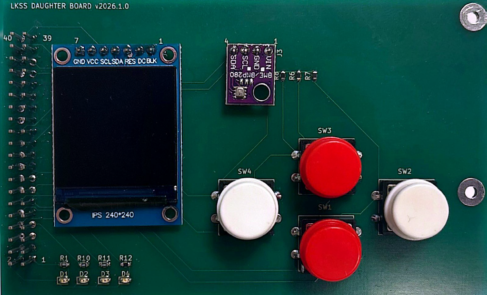

.. _lkss_daughter_board:

LKSS-DAUGHTER-BOARD
===================

**LKSS-DAUGHTER-BOARD** is an accessory board compatible with the :ref:`FRDM-IMX93 <frdm_imx93>`
board, designed to be used in the context of **Linux Kernel Summer School** and offering the
following hardware features:

* 40-pin expansion header
* 4 x push button
* 1 x power LED
* 3 x user-controllable LEDs
* 1 x 4-pin header compatible with BMP280-based module
* 1 x 7-pin header compatible with ST7789V-based LCD module

A top view of the accessory board is shown in :numref:`lkss-daughter-board-top-view`.

.. _lkss-daughter-board-top-view:

   
   Top view of the LKSS-DAUGHTER-BOARD board [#]_

Design files
------------

The archive containing the design files can be downloaded from
:download:`here <../_static/content/LKSS-DAUGHTER-BOARD-DF.zip>`. This includes:

.. code-block:: text

   .
   └── SCHEMATIC.pdf # board schematic

.. rubric:: Footnotes

.. [#] The LCD and sensor are not normally soldered onto the board so they are
       not included in the design files. However, they can be attached to it
       using the 4 and 7-pin headers present on the board.
