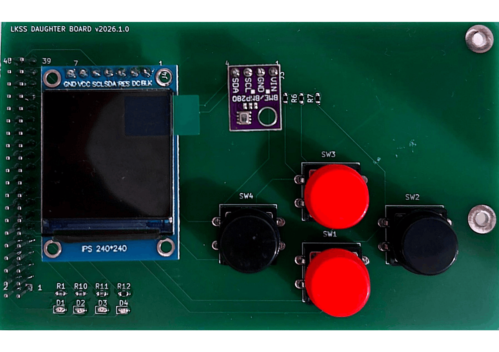
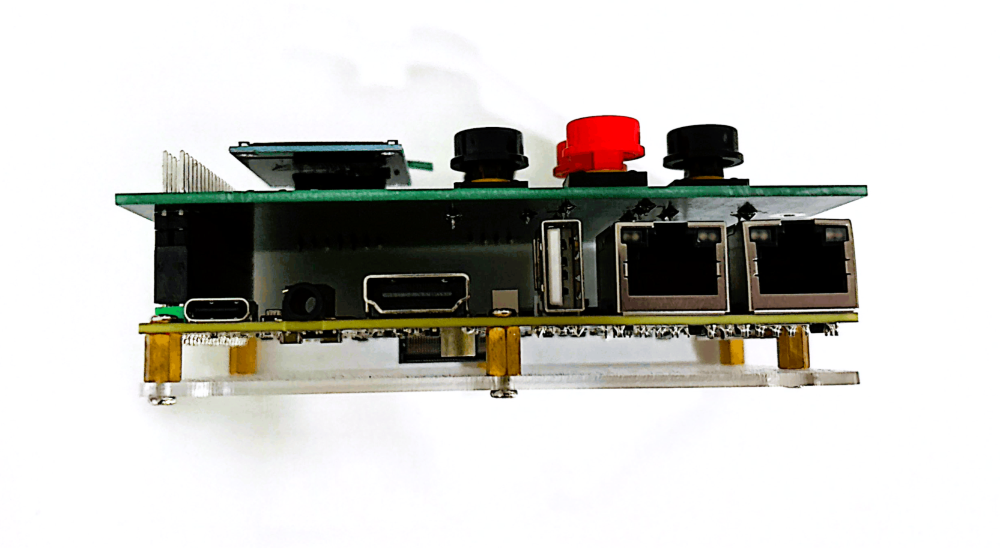
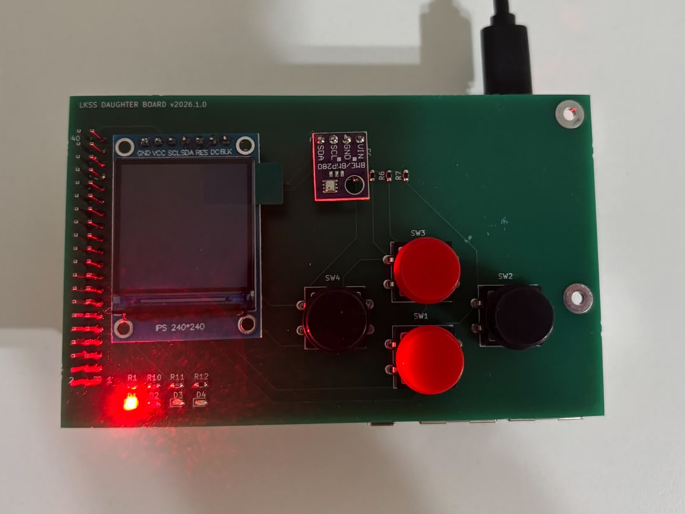

.. _lkss_daughter_board:

LKSS-DAUGHTER-BOARD
===================

**LKSS-DAUGHTER-BOARD** is an accessory board compatible with the :ref:`FRDM-IMX93 <frdm_imx93>`
board, designed to be used in the context of **Linux Kernel Summer School** and offering the
following hardware features:

* 40-pin expansion header and socket
* 4 x push button
* 1 x power LED
* 3 x user-controllable LEDs
* 1 x 4-pin header compatible with BMP280-based module
* 1 x 7-pin header compatible with ST7789V-based LCD module

A top view of the accessory board is shown in :numref:`lkss-daughter-board-top-view`.

.. _lkss-daughter-board-top-view:

.. figure:: ../_static/figures/LKSS-DAUGHTER-BOARD-TOP-VIEW.png
   :align: center
   :scale: 20
   
   Top view of the LKSS-DAUGHTER-BOARD board

Connecting the modules
----------------------

The accessory board contains two pin headers (J3 and J4), which can be used to
connect the `BMP280`_ and `ST7789V`_-based modules. The two modules should be
connected as shown in :numref:`lkss-daughter-board-module-connection`.

.. _lkss-daughter-board-module-connection:

   Connecting the sensor and LCD modules

Connecting the accessory board
------------------------------

The accessory board should be connected to the FRDM-IMX93 board using the 40-pin
expansion header. To do so, make sure pin 1 of both expansion headers are aligned
and then slowly push the accessory board's socket in.

.. warning::

   Make sure FRDM-IMX93's power source is disconnected while doing this!

:numref:`lkss-daughter-board-long-view` shows the two connected boards.

.. _lkss-daughter-board-long-view:

   FRDM-IMX93 and accessory board connection

To check if the accessory board was properly connected, connect the power supply
to the FRDM-IMX93 board. If everything went well, the power LED on the accessory
board (i.e. D1) should be turned on as shown in :numref:`lkss-daughter-board-power-on`.

.. _lkss-daughter-board-power-on:

   Accessory board power LED

Design files
------------

The archive containing the design files can be downloaded from
:download:`here <../_static/content/LKSS-DAUGHTER-BOARD-DF.zip>`. This includes:

.. code-block:: text

   .
   ├── BOM.csv       # bill of materials
   └── SCHEMATIC.pdf # board schematic

.. _BMP280: https://sigmanortec.ro/display-tft-13-ips-spi-65k-culori-lcd-st7789v-240x240-7p
.. _ST7789V: https://sigmanortec.ro/modul-presiune-temperatura-si-umiditate-bmp280-5v
