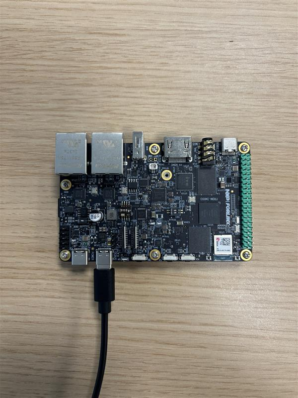
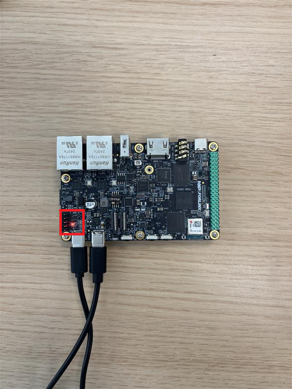
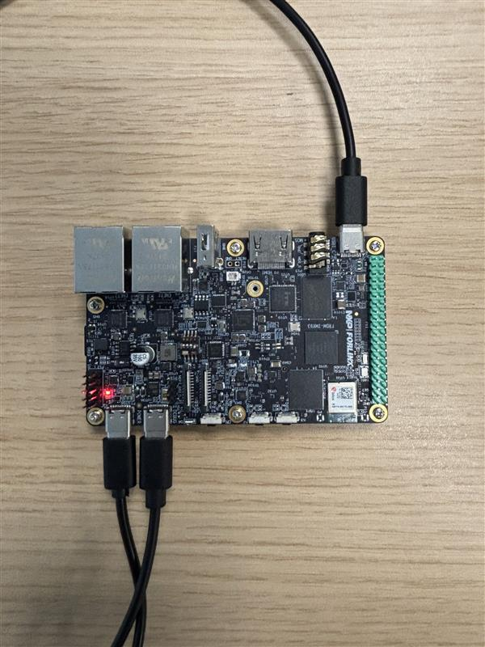
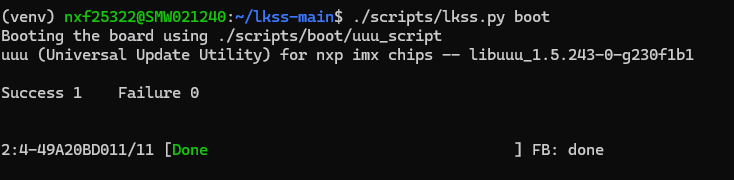
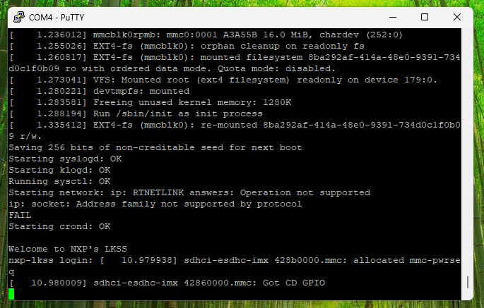
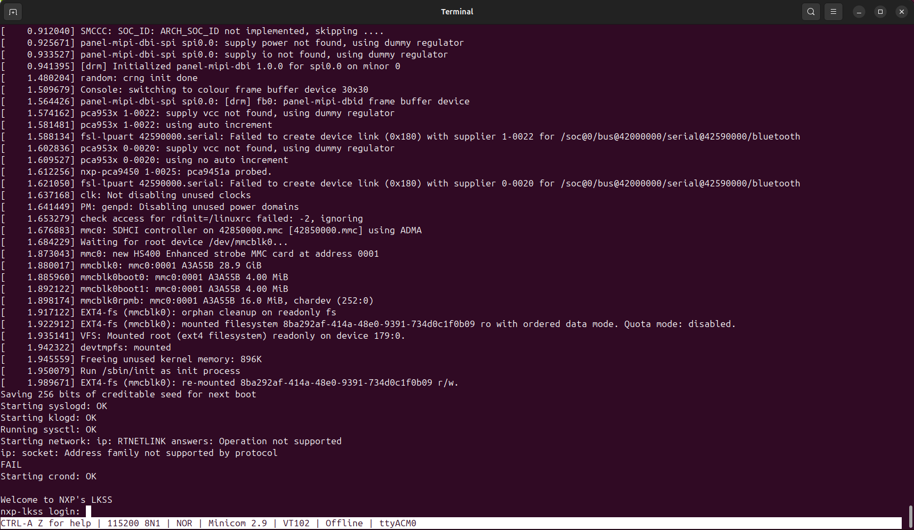

.. _booting_the_board:

Booting the board
=================

This page describes the steps required for booting the Linux kernel on the
FRDM-IMX93 board.

Prerequisites
-------------

Before proceeding, make sure you prepare your development environment by following
the steps described :ref:`here <infrastructure>`. Additionally, please make sure
you also read :ref:`this <development_board>` page to get acquainted with the
FRDM-IMX93 board.

Hardware setup
--------------

As described :ref:`here <frdm-imx93-usb-c-ports-section>`, the board has three
USB-C ports, which we'll need to connect to our host computer in order to boot
and debug the board.

Configuring the boot switch
~~~~~~~~~~~~~~~~~~~~~~~~~~~

We will be using USB as the boot medium. As such, please make sure that
the boot switch is set to **1000** as described :ref:`here <frdm-imx93-boot-switch-section>`.

.. _board-boot-debug-usb-connection:

Connecting DEBUG USB
~~~~~~~~~~~~~~~~~~~~

First, connect the **DEBUG USB** port to your computer as shown in
:numref:`frdm-imx93-debug-usb-connection`.

.. _frdm-imx93-debug-usb-connection:

   FRDM-IMX93 DEBUG USB connection

To make sure the connection was successful, you can:

.. tabs::

   .. group-tab:: Linux

      Run ``sudo dmesg`` in your terminal. Look for the following logs
      (or something similar):

      .. image:: _static/figures/FRDM-IMX93-DEBUG-USB-LINUX.png
         :align: center
         :scale: 40

      If the board was detected, you should see two new ttyACM devices.

   .. group-tab:: Windows

      #. Open up **Device Manager**:

         .. image:: _static/figures/WINDOWS-DEVICE-MANAGER.png
            :align: center
            :scale: 40

      #. Look for and open the **Ports (COM & LPT)** tab:

         .. image:: _static/figures/WINDOWS-DEVICE-MANAGER-PORTS.png
            :align: center
            :scale: 40

      If the board was detected, you should see two new CH342 serial devices.

Connecting POWER USB
~~~~~~~~~~~~~~~~~~~~

Now, connect the **POWER USB** to a power source [#]_ as shown in
:numref:`frdm-imx93-power-usb-connection`.

.. _frdm-imx93-power-usb-connection:

   FRDM-IMX93 POWER USB connection

The red LED highlighted in :numref:`frdm-imx93-power-usb-connection` indicates
that the board is connected to a power source.

Connecting BOOT USB
~~~~~~~~~~~~~~~~~~~

Finally, connect the **BOOT USB** as shown in :numref:`frdm-imx93-boot-usb-connection`.

.. _frdm-imx93-boot-usb-connection:

   FRDM-IMX93 BOOT USB connection

To make sure the connection was successful, you can:

.. tabs::

   .. group-tab:: Linux

      Run ``sudo dmesg`` in your terminal. Look for the following logs
      (or something similar):

      .. image:: _static/figures/FRDM-IMX93-BOOT-USB-LINUX.png
         :align: center
         :scale: 40

      The manufacturer name, **idVendor**, and **idProduct** should match
      those shown above.

   .. group-tab:: Windows

      #. Open up **Device Manager**:

         .. image:: _static/figures/WINDOWS-DEVICE-MANAGER.png
            :align: center
            :scale: 40

      #. Look for and open the **Human Interface Devices** tab:

         .. image:: _static/figures/WINDOWS-DEVICE-MANAGER-HID.png
            :align: center
            :scale: 40

      You should see that a new **USB Input Device** was added. To check
      if the new entry was added as a result of connecting the board:

      #. Open the **Properties** tab by right-clicking on the device:

         .. image:: _static/figures/WINDOWS-DEVICE-MANAGER-HID-USB-PROPERTIES.png
            :align: center
            :scale: 40

      #. Go to the **Details** tab and select the **Hardware Ids** property:

         .. image:: _static/figures/WINDOWS-DEVICE-MANAGER-HID-HW-IDS.png
            :align: center
            :scale: 40

      The device should have VID **1FC9** and PID **014E**.

Software setup
--------------

Preparing the kernel image
~~~~~~~~~~~~~~~~~~~~~~~~~~

To boot the Linux kernel, we'll first have to compile it. To do so, run:

.. code-block:: bash

   ./scripts/lkss.py compile -j$(nproc) --install-modules --clean-config

.. note::

   If this is not your first kernel compilation, you can omit the **--clean-config**
   flag.

.. note::

   The compilation might take a while, depending on your host's processing power.

If the compilation was successful, you should now see the **output** directory,
containing the following build artifacts:

.. code-block:: text

   output/
   ├── Image # compiled Linux kernel image
   └── imx93-11x11-frdm.dtb # board DTB

Serial console setup
~~~~~~~~~~~~~~~~~~~~

For debug purposes, the interaction between the host computer and the
board is performed using the **DEBUG USB** port. From the software's
point of view, this interaction requires opening up a **serial console**
on your host computer. To do so:

.. tabs::

   .. group-tab:: Linux

      #. Open a **minicom** [#]_ console:

         .. code-block:: bash

            sudo minicom -D /dev/ttyACM0

      #. Open the **help** menu by pressing **CTRL-a Z**:A

          .. image:: _static/figures/LINUX-MINICOM-HELP.png
             :align: center
             :scale: 40

      #. Open the **cOnfigure Minicom** menu by pressing **O** (capital letter):

         .. image:: _static/figures/LINUX-MINICOM-CFG.png
            :align: center
            :scale: 40

      #. Open the **Serial port setup** menu by using the arrow and **Enter** keys:

         .. image:: _static/figures/LINUX-MINICOM-SERIAL-SETUP.png
            :align: center
            :scale: 40

      #. Make sure **Hardware Flow Control** is set to **No**:

         .. image:: _static/figures/LINUX-MINICOM-SERIAL-SETUP-HFC.png
            :align: center
            :scale: 40

      #. Make sure **Bps/Par/Bits** is set to **115200 8N1**:

         .. image:: _static/figures/LINUX-MINICOM-SERIAL-SETUP-PROTO.png
            :align: center
            :scale: 40

      #. Close the **Serial port setup** menu by pressing **Enter**
      #. Navigate to **Save setup as dfl** and press **Enter**
      #. Navigate to **Exit** and press **Enter**

   .. group-tab:: Windows

      #. Open **PuTTY**:

         .. image:: _static/figures/WINDOWS-PUTTY.png
            :align: center
            :scale: 30

      #. Select the **Serial** connection type:

         .. image:: _static/figures/WINDOWS-PUTTY-SERIAL.png
            :align: center
            :scale: 40

      #. Set the speed to **115200**:

         .. image:: _static/figures/WINDOWS-PUTTY-SERIAL-SPEED.png
            :align: center
            :scale: 40

      #. Type in **COM3** as the serial device name and then click **Open**:

         .. image:: _static/figures/WINDOWS-PUTTY-SERIAL-DEV.png
            :align: center
            :scale: 40

      .. note::

         The name of your serial device might differ. If so, open **Device Manager**
         as shown in :ref:`board-boot-debug-usb-connection`, navigate to the
         **Ports (COM & LPT)** tab and look for the name of your serial device.

Booting the board
-----------------

To boot the board, run:

.. code-block:: bash

   ./scripts/lkss.py boot

If the command was successful, you should see the following output in your terminal:

Additionally, based on your operating system, you should see some logs in your
serial console as shown in :numref:`frdm-imx93-boot-windows-putty` or
:numref:`frdm-imx93-boot-linux-minicom`.

.. _frdm-imx93-boot-windows-putty:

   Logs printed during the board boot process (Windows, PuTTY)

.. _frdm-imx93-boot-linux-minicom:

   Logs printed during the board boot process (Linux, minicom)

.. tip::

   If your serial console is not displaying any logs, try using the other
   one. For Linux, that would be **ttyACM1** and for Windows, that would be
   **COM4**.

.. rubric:: Footnotes

.. [#] This can be a phone charger, your computer, etc..
.. [#] https://man7.org/linux/man-pages/man1/minicom.1.html
