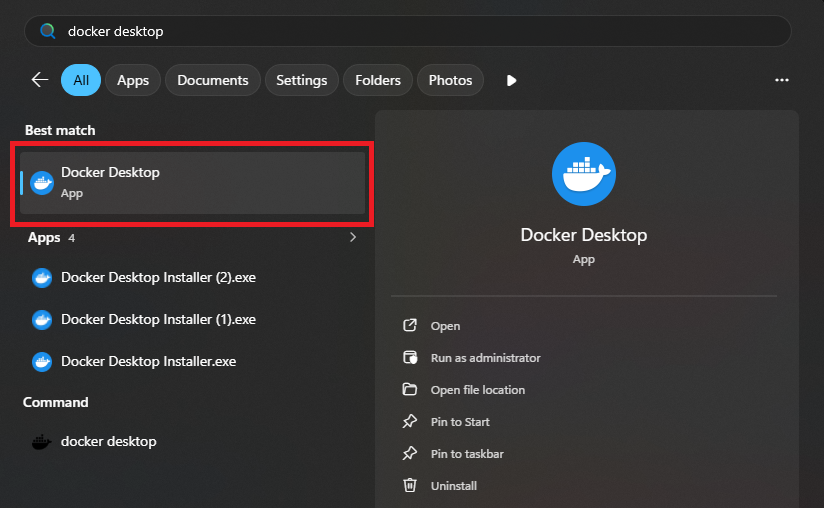
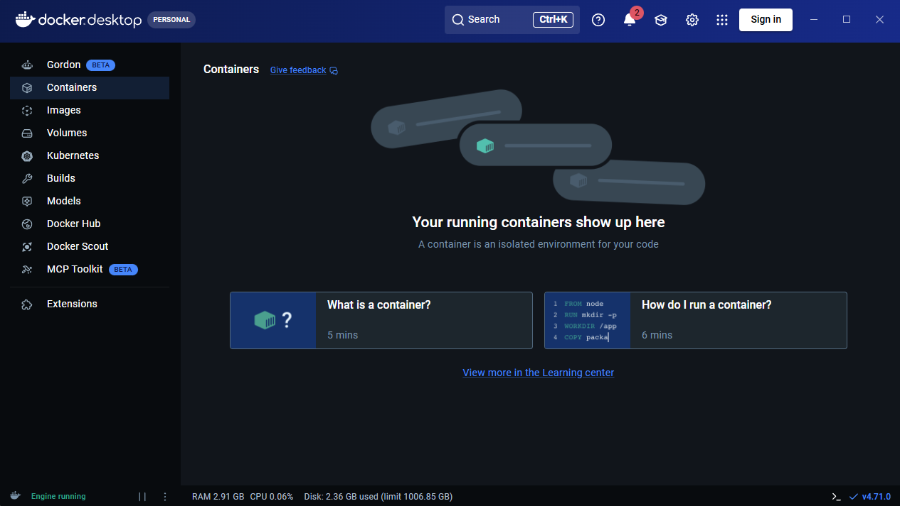

:orphan:

.. _windows-infrastructure:

Preparing the environment (Windows)
===================================

.. contents::
   :depth: 2
   :local:

About
-----

This page describes the steps required for setting up the development infrastructure
on a Windows-based machine.

Prerequisites
-------------

Before getting started, make sure you have a machine running Windows 11 natively.
Regardless of the chosen environment, we're going to have to manually install some
packages, which are listed below:

.. list-table:: List of required common packages
   :header-rows: 1
   :widths: 30 30 30
   :align: center

   * - Package name
     - Download link
     - Comments

   * - PuTTY
     - `Link <https://www.chiark.greenend.org.uk/~sgtatham/putty/latest.html>`__
     - Can also download from Microsoft Store

   * - WSL 2
     - `Link <https://learn.microsoft.com/en-us/windows/wsl/install>`__
     - Follow instructions from link

.. note::

   We recommend choosing **Ubuntu** as the WSL distribution.

Once WSL is installed, start a new session by running:

.. code-block:: powershell

   wsl

inside a **Powershell** or a **Command Prompt** terminal. After doing so,
we're going to need some additional packages, which can be installed by
running:

.. code-block:: bash

   sudo apt-get update
   sudo apt-get install -y git python3-venv python3 python3-pip

.. note::

   For the following sections, all of the commands will be issued inside WSL
   unless explicitly mentioned otherwise.

Cloning the repository
----------------------

To clone the project repository:

.. code-block:: bash

   git clone https://github.com/NXP-Research/lkss-main && cd lkss-main

Preparing the python environment
--------------------------------

Follow steps from :ref:`linux-preparing-the-python-environment`.

.. warning::

   Don't forget to activate the python virtual environment each time you start
   a new WSL session.

Native development
------------------

Follow steps from :ref:`Linux native development <linux-native-development>`.

Docker development
------------------

.. _windows-docker-development-prerequisites:

Prerequisites
~~~~~~~~~~~~~

To get started, we're going to have to install `Docker`_. To do so, follow
`these instructions <https://docs.docker.com/desktop/setup/install/windows-install/>`__.

.. note::

   Use WSL 2 as backend.

If everything went well with the installation, you should now be able to start
Docker Desktop. To do so, open the **Start** menu and type in **Docker Desktop**
as shown below:

   Starting Docker Desktop

After opening **Docker Desktop**, you should now be greeted with the following
interface:

   Docker Desktop interface

For now, you can close the Docker Desktop interface since we're going to be using
the CLI for container and image management.

.. note::

   After closing the Docker Desktop interface, the process should remain running.

   To check this, navigate to the bottom right of your screen, press on the upward
   facing arrow and look for the docker icon as shown below:

   .. figure:: ../_static/figures/WINDOWS-DOCKER-DESKTOP-PROCESS.png
      :align: center

.. warning::

   Please make sure the Docker Desktop process is running before you start developing.

Docker environment initialization
~~~~~~~~~~~~~~~~~~~~~~~~~~~~~~~~~

With Docker installed, we can now proceed with the environment initialization:

.. code-block:: bash

   ./scripts/lkss.py init --runner docker -f

.. warning::

   If you get an error similar to:

   .. code-block:: text

      RuntimeError: Unable to find docker - please install it

   even though you've already installed Docker Desktop, please make sure that
   the Docker Desktop process is running. See :ref:`windows-docker-development-prerequisites`.

If all commands issued so far have returned successfully, your environment
should now be prepared for Docker development.

.. _Docker: https://www.docer.com/
